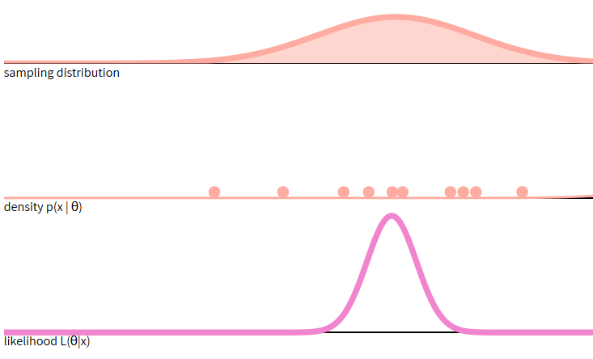
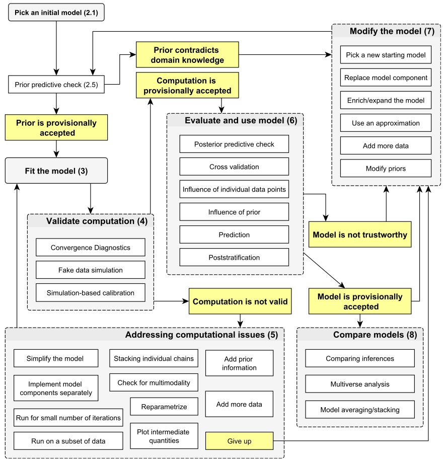

```{r knitr_setup, include=FALSE, cache=FALSE}

library('knitr')

### Chunk options ###

## Text results
opts_chunk$set(echo = FALSE, warning = FALSE, message = FALSE, size = 'tiny')

## Code decoration
opts_chunk$set(tidy = FALSE, comment = NA, highlight = TRUE, prompt = FALSE, crop = TRUE)

# ## Cache
opts_chunk$set(cache = TRUE)

# ## Plots
# opts_chunk$set(fig.path = 'knitr_output/figures/')
opts_chunk$set(fig.align = 'center', out.width = '90%')

### Hooks ###
## Crop plot margins
knit_hooks$set(crop = hook_pdfcrop)

## Reduce font size
## use tinycode = TRUE as chunk option to reduce code font size
# see http://stackoverflow.com/a/39961605
knit_hooks$set(tinycode = function(before, options, envir) {
  if (before) return(paste0('\n \\', options$size, '\n\n'))
  else return('\n\n \\normalsize \n')
  })

```


## Our dataset: tree heights and DBH

::: nonincremental :::
- One species
- 10 plots
- 1000 trees
- Number of trees per plot ranging from 4 to 392

```{r echo=1}
trees <- read.csv('data/trees.csv')
summary(trees[, 1:3])
```

:::


## What's the relationship between DBH and height?

```{r echo=FALSE}
plot(trees$dbh, trees$height, pch=20, las=1, cex.lab=1.4, xlab='DBH (cm)', ylab='Height (m)')
```


## First step: linear regression (lm)

\footnotesize

```{r lm, echo=1}
simple.lm <- lm(height ~ dbh, data = trees)
summary(simple.lm)
```


## Center continuous variables

```{r echo=TRUE}
summary(trees$dbh)
trees$dbh.c <- trees$dbh - 25
```

So, all parameters will be referred to a 25 cm DBH tree.


## Linear regression with centred DBH

:::::::::::::: {.columns align=center}

::: {.column width='40%'}
```{r echo=FALSE}
plot(trees$dbh.c, trees$height, pch=20, las=1, cex.lab=1.4, xlab='DBH (cm)', ylab='Height (m)')
abline(lm(height ~ dbh.c, data=trees), col='red', lwd=3)
```
:::

::: {.column width='60%' }
```{r echo=FALSE}
library(arm)
simple.lm <- lm(height ~ dbh.c, data = trees)
display(simple.lm)
```
:::
::::::::::::::


# Let's make it Bayesian

## Bayesian inference: prior, posterior, and likelihood

$P(Unknown|Data) \propto P(Data|Unknown) \times P(Unknown)$

$Posterior \propto Likelihood \times Prior$

```{r echo = FALSE, results='hide'}

set.seed(28)
# example with tree diameters
diam.sd <- 20
diam <- rnorm(8, 30, diam.sd)

prior.diam <- 50
prior.diam.var <- 100

library(blmeco)
blmeco::triplot.normal.knownvariance(theta.data = mean(diam), 
                                     n = length(diam), 
                                     variance.known = diam.sd*diam.sd, 
                                     prior.theta = prior.diam, 
                                     prior.variance = prior.diam.var)
title("Sample size = 8")
```


```{r echo = FALSE, results='hide', eval=FALSE}

# height <- runif(10, 170, 190)
# 
# prior.height <- 160
# prior.height.var <- 20

set.seed(123)
# example with students' hours of sleep
sleephours.sd <- 2
sleephours <- rnorm(8, 9, sleephours.sd)

prior.sleep <- 7
prior.sleep.var <- 1

library(blmeco)
blmeco::triplot.normal.knownvariance(theta.data = mean(sleephours), 
                                     n = length(sleephours), 
                                     variance.known = sleephours.sd*sleephours.sd, 
                                     prior.theta = prior.sleep, 
                                     prior.variance = prior.sleep.var)
title("How many hours of daily sleep?")
```

## What is the likelihood?

$L(\theta|x) = P(x|\theta)$

```{r echo=FALSE}

```

\tiny https://seeing-theory.brown.edu/bayesian-inference/index.html


## Bayesian inference: prior and likelihood produce posterior

```{r echo = FALSE, results='hide'}

set.seed(28)
# example with tree diameters
diam.sd <- 20
diam <- rnorm(8, 30, diam.sd)

prior.diam <- 50
prior.diam.var <- 100

library(blmeco)
blmeco::triplot.normal.knownvariance(theta.data = mean(diam), 
                                     n = length(diam), 
                                     variance.known = diam.sd*diam.sd, 
                                     prior.theta = prior.diam, 
                                     prior.variance = prior.diam.var)
title("Sample size = 8")
```


## With increasing sample size, likelihood dominates prior

```{r echo = FALSE, results='hide'}

set.seed(28)
# example with tree diameters
diam.sd <- 20
diam <- rnorm(100, 30, diam.sd)

prior.diam <- 50
prior.diam.var <- 100

library(blmeco)
blmeco::triplot.normal.knownvariance(theta.data = mean(diam), 
                                     n = length(diam), 
                                     variance.known = diam.sd*diam.sd, 
                                     prior.theta = prior.diam, 
                                     prior.variance = prior.diam.var)
title("Sample size = 100")
```


## Bayesian statistics in practice

- Integrate information (**prior**)

- Prior **regularises** unlikely estimates from data

- Particularly important with **limited** sample sizes

- Large dataset -> prior effect **diminishes**

- **Uncertainty** / **Propagate errors**


## Remember our model structure

$$
  \begin{aligned}
  y_{i} \sim N(\mu_{i}, \sigma^2) \\ 
  \mu_{i} = \alpha + \beta x_{i} 
  \end{aligned}
$$

In this case:

$$
  \begin{aligned}
  Height_{i} \sim N(\mu_{i}, \sigma^2)  \\
  \mu_{i} = \alpha + \beta DBH_{i} 
  \end{aligned}
$$

$\alpha$: expected height when DBH = 25 cm

$\beta$: how much height increases with every unit increase of DBH


## Defining model formula

```{r echo=T}
library('brms')

height.formu <- brmsformula(height ~ dbh.c)
```


---

\Large

We must define **prior distributions** for every parameter


## brms default priors

\scriptsize

```{r echo=1}
get_prior(height.formu, data = trees)
```


## Choosing priors

Avoid 'non-informative' priors 

Use *weakly informative* (e.g. relatively wide Normal or t-student distributions)    

or *strongly informative* priors based on previous knowledge and common sense.

Some tips for setting priors: 

- https://github.com/stan-dev/stan/wiki/Prior-Choice-Recommendations

- [Priors chapter](https://www.routledge.com/rsc/downloads/Bayesian_FreeBook_Final.pdf?srsltid=AfmBOor9tMa_Aq_uAUA9Ol8w4U_bQ9dc-EDmDARh17vVjmz66i1sdUq2&page=8) in The BUGS book

- https://doi.org/10.1111/oik.05985

Run **prior predictive checks** (just priors, no data)


## Probability distribution explorer

https://distribution-explorer.github.io/


## Example: estimating people height across countries

:::::::::::::: {.columns align=center}

::: {.column width='50%'}
Unreasonable prior

```{r echo=FALSE}
library(ggplot2)
# plot(density(rnorm(1000, 0, 1000)), main='', xlab='Height (m)', cex.axis = 3, cex.lab = 3)
data.frame(h = rnorm(1000, 0, 1000)) |> 
  ggplot() +
  geom_density(aes(h)) +
  theme_minimal(base_size = 32) +
  labs(x = "Height (m)")
```
:::

::: {.column width='50%' }
Reasonable prior

```{r echo=FALSE}
# plot(density(rnorm(1000, 2, 0.5)), main='', xlab='Height (m)', cex.axis = 3, cex.lab = 3)
data.frame(h = rnorm(1000, 2, 0.5)) |> 
  ggplot() +
  geom_density(aes(h)) +
  theme_minimal(base_size = 32) +
  labs(x = "Height (m)")
```
:::
::::::::::::::


## Defining priors for our trees example

```{r echo=T}
priors <- c(
  set_prior('normal(30, 10)', class = 'Intercept'), 
  set_prior('normal(0.5, 0.4)', class = 'b'),
  set_prior('normal(0, 5)', class = 'sigma')
)
```


## Prior for intercept (average height of 25-cm diameter tree)

```{r echo=F}
data.frame(h = rnorm(1000, 25, 10)) |> 
  ggplot() +
  geom_density(aes(h)) +
  theme_minimal(base_size = 30) +
  labs(x = "Height (m)")
```


## Prior for slope

```{r echo=F}
data.frame(h = rnorm(1000, 0.5, 0.5)) |> 
  ggplot() +
  geom_density(aes(h)) +
  theme_minimal(base_size = 30) +
  labs(x = "slope (m/cm)")
```


## Prior for sigma (residual sd)

```{r echo=F}
sig <- rnorm(10000, 0, 5)
sigma <- na.omit(ifelse(sig < 0, NA, sig))
hist(sigma, breaks = 30, probability = T, cex.axis = 1.5)
```


## Prior predictive check

```{r echo=T, results='hide'}
height.mod <- brm(height.formu,
         data = trees,
         prior = priors,
         sample_prior = 'only')
```


## Prior predictive check

```{r echo=T}
pp_check(height.mod, ndraws = 100)
```


## Fit model (now with data)

```{r echo=T, results='hide'}
height.mod <- brm(height.formu,
         data = trees,
         prior = priors)
```


## Model summary

\scriptsize

```{r echo=T}
summary(height.mod)
```


## Model visualisation

```{r echo=T}
plot(height.mod)
```


## Posterior predictive checking

```{r echo=T}
pp_check(height.mod, ndraws = 100)
```


## Interactive model exploration

```{r echo=T, eval=FALSE}
library('shinystan')
launch_shinystan(height.mod)
```


## The Bayesian workflow

```{r out.width='70%'}

```

\tiny https://arxiv.org/abs/2011.01808

## Exercise

\Large

height ~ sex


## To read more

[Regression and other stories](https://avehtari.github.io/ROS-Examples/)

[Statistical Rethinking](https://xcelab.net/rm/)

[Statistical rethinking with brms, ggplot2, and the tidyverse](https://bookdown.org/content/4857/)

[Bayesian Population Analysis using WinBugs](https://www.sciencedirect.com/book/9780123870209/bayesian-population-analysis-using-winbugs)

[Applied Hierarchical Modeling in Ecology](https://www.mbr-pwrc.usgs.gov/pubanalysis/keryroylebook/)

[Stan user guide](https://mc-stan.org/docs/stan-users-guide/)

