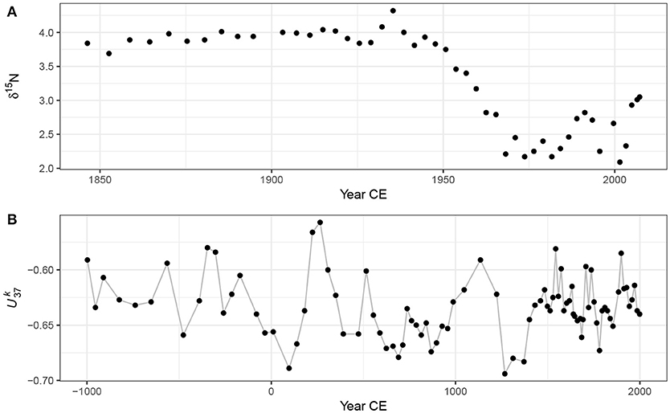
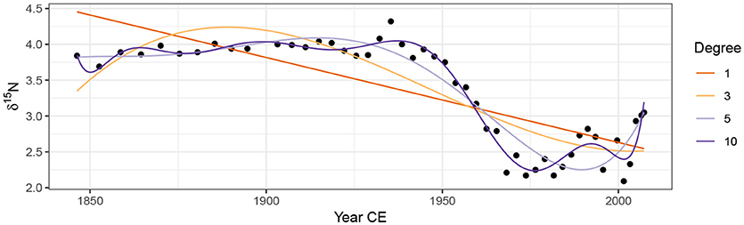

```{r knitr_setup, include=FALSE, cache=FALSE}

library("knitr")

### Chunk options ###

## Text results
opts_chunk$set(echo = FALSE, warning = FALSE, message = FALSE, size = 'tiny')

## Code decoration
opts_chunk$set(tidy = FALSE, comment = NA, highlight = TRUE, prompt = FALSE, crop = TRUE)

# ## Cache
# opts_chunk$set(cache = TRUE, cache.path = "knitr_output/cache/")

# ## Plots
# opts_chunk$set(fig.path = "knitr_output/figures/")
opts_chunk$set(fig.align = 'center', out.width = '90%')

### Hooks ###
## Crop plot margins
knit_hooks$set(crop = hook_pdfcrop)

## Reduce font size
## use tinycode = TRUE as chunk option to reduce code font size
# see http://stackoverflow.com/a/39961605
knit_hooks$set(tinycode = function(before, options, envir) {
  if (before) return(paste0("\n \\", options$size, "\n\n"))
  else return("\n\n \\normalsize \n")
  })

```


## How do we model these time series?

```{r}

```

\scriptsize 
[Simpson 2018](https://doi.org/10.3389/fevo.2018.00149)


## How do we model these time series?

```{r}

```

\scriptsize 
[Simpson 2018](https://doi.org/10.3389/fevo.2018.00149)


## GAMs allow us to model non-linear relationships using smooths

Generalised Linear Model (GLM):

$$
y = a + bx
$$


Generalised Additive Model (GAM):

$$
y = a + s(x)
$$


## Modelling non-linear time series with GAM

```{r echo = 1}
isotopes <- readRDS("data/isotope.rds")
head(isotopes)
```

## Modelling non-linear time series with GAM

\scriptsize

```{r echo = 1:2}
library("mgcv")
m <- gam(d15N ~ s(Year, k = 15), data = isotopes, method = "REML")
summary(m)
```


## Visualising fitted GAM

```{r echo = 2}
library("visreg")
visreg(m)
```


## Checking fitted GAM

```{r echo = TRUE}
library("DHARMa")
simulateResiduals(m, plot = TRUE)
```


## Checking fitted GAM

```{r echo = TRUE}
gam.check(m)
```


::: hide :::
## Checking fitted GAM

```{r echo = TRUE}
testTemporalAutocorrelation(simulateResiduals(m), 
                            time = isotopes$Year)
```
:::


## Including temporal autocorrelation

\footnotesize

```{r echo = 1}
mod <- gamm(d15N ~ s(Year, k = 15), data = isotopes,
            correlation = corCAR1(form = ~ Year), method = "REML")
summary(mod$gam)
```


# Modelling infant mortality 

## Modelling infant mortality 


```{r echo=1}
mort <- read.csv("data/UN_GDP_infantmortality.csv")
head(mort)
```

## Modelling infant mortality with a GLM

\footnotesize

```{r echo = 1:2}
library("MASS")
mort.glm <- glm.nb(infant.mortality ~ gdp, data = mort)
summary(mort.glm)
```


## Modelling infant mortality with a GLM

```{r }
visreg(mort.glm)
```


## Modelling infant mortality with a GLM (log.gdp)

\footnotesize

```{r echo = 1:2}
mort$log.gdp <- log(mort$gdp)
mort.glm.log <- glm.nb(infant.mortality ~ log.gdp, data = mort)
summary(mort.glm.log)
```

## Modelling infant mortality with a GLM (log.gdp)

```{r}
visreg(mort.glm.log)
```


## Modelling infant mortality with a GAM

\footnotesize

```{r echo = 1:2}
library("mgcv")
mort.gam <- gam(infant.mortality ~ s(log.gdp), family = nb, data = mort)
summary(mort.gam)
```


## Modelling infant mortality with a GAM

```{r}
visreg(mort.gam)
```


## Checking GAM

```{r echo =T}
gam.check(mort.gam)
```


## Comparing models

```{r echo =T}
library("performance")
compare_performance(mort.glm, mort.glm.log, mort.gam)
```


# Generalised Additive Mixed Models (GAMM)

## Reaction time with sleep deprivation

```{r echo=1:2}
library("lme4")
data("sleepstudy")
library("ggplot2")
ggplot(sleepstudy) +
  aes(x = Days, y = Reaction) +
  geom_point() +
  facet_wrap(~Subject) 
```


## Modelling reaction time with sleep deprivation (GAMM)

\scriptsize

```{r echo = 1}
sgamm <- gam(Reaction ~ s(Days, Subject, k = 3, bs = "fs"), 
                   data = sleepstudy, method = "REML")
summary(sgamm)
#gam.check(sleep.gamm)
#coef(p)
```


## Modelling reaction time with sleep deprivation (GAMM)

```{r echo = T}
visreg(sgamm, xvar = "Days", by = "Subject")
```


