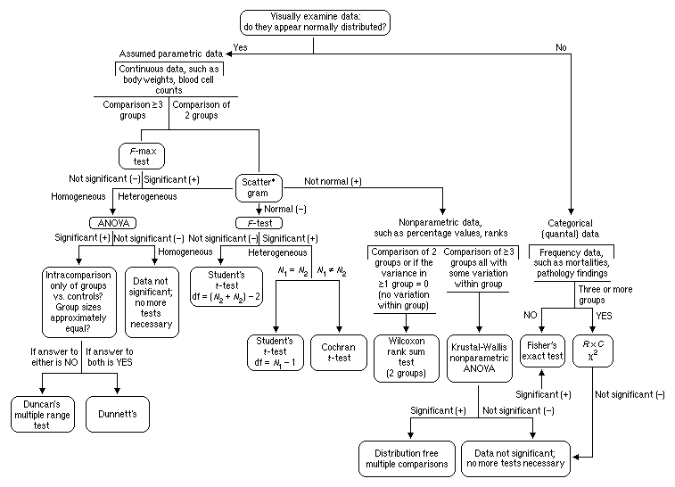
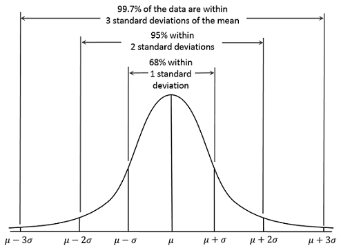
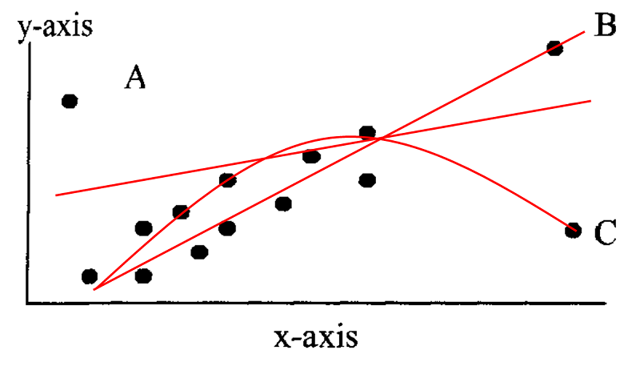

```{r knitr_setup, include=FALSE, cache=FALSE}

library(rmarkdown)
library(knitr)

### Chunk options ###

## Text results
opts_chunk$set(echo = TRUE, warning = FALSE, message = FALSE)

## Code decoration
opts_chunk$set(tidy = FALSE, comment = NA, highlight = TRUE, size = "footnotesize")

# ## Cache
opts_chunk$set(cache = 2, cache.path = "knitr_output/cache/")
# opts_chunk$set(cache.extra = rand_seed)
# 
# ## Plots
opts_chunk$set(fig.path = "knitr_output/figures/")
# opts_chunk$set(dpi = 300, fig.align = "default")   # may want 'center' sometimes
# 
# # Figure format
# opts_chunk$set(dev='pdf')  # e.g. choose among 'pdf', 'png', 'svg'...
# # may include specific dev.args as a list... see knitr help


### Hooks ###

## Crop plot margins
#knit_hooks$set(crop = hook_pdfcrop)   


```


## Modern statistics are easier than this




## Our overarching regression framework 


$$
  \begin{aligned}  
  y_{i}=a+bx_{i}+\varepsilon _{i} \\  
  \varepsilon _{i}\sim N\left( 0,\sigma^2 \right) \\  
  \end{aligned}  
$$

\begincols

\begincol
```{r regplot, echo=FALSE, fig.align='left', fig.height=5, fig.width=4}
data(iris)
setosa <- iris[iris$Species == "setosa", ]
plot(setosa[,3], setosa[,4], xlab = "x", ylab = "y", ylim = c(-0.1, 0.65), 
     pch=19, las = 1, cex.lab = 1.5, xlim = c(0, 2))
abline(lm(setosa[,4] ~ setosa[,3]), lwd = 3)
```
\endcol

\begincol

**Data**  
*y* = response variable  
*x* = predictor 
    

**Parameters**  
*a* = intercept    
*b* = slope     
$\sigma$ = residual variation    
$\varepsilon$ = residuals  

\endcol
\endcols


## Residual variation (error) 

\begincols
\begincol
```{r small_residuals, echo=FALSE, fig.width=4}
set.seed(123)
x <- runif(50, 10, 30)
y <- rnorm(50, 4 + 0.3*x, 0.5)
plot(x, y, las = 1, main = "small")
abline(lm(y ~ x), lwd = 3)
```
\endcol

\begincol
```{r large_residuals, echo=FALSE, fig.width=4}
y2 <- rnorm(50, 4 + 0.3*x, 3)
plot(x, y2, las = 1, main = "large")
abline(lm(y2 ~ x), lwd = 3)
```
\endcol
\endcols


## Residual variation

$$
  \begin{aligned}  
  \varepsilon _{i}\sim N\left( 0,\sigma^2 \right) \\  
  \end{aligned}  
$$

```{r sigmas, echo=FALSE, fig.align='center'}
s1 <- density(rnorm(1000, 0, 2))
s2 <- density(rnorm(1000, 0, 5))
s3 <- density(rnorm(1000, 0, 10))
plot(s3, ylim=c(0,0.2), ylab="", xlab="", main="Distribution of residuals", lwd=2, col="red", yaxt="n")
lines(s2, lwd=2, col="blue")
lines(s1, lwd=2)
Hmisc::labcurve(list(s1, s2, s3), labels=paste("sigma = ", c(2,5,10), sep=""), type="l", col=c("black", "blue", "red"))
```


## In a Normal distribution



$\overline {x} \pm SD$ enclose **68%** of the data

$\overline {x} \pm 2SD$ enclose **95%** of the data

$\overline {x} \pm 3SD$ enclose **99%** of the data


# Quick refresher of linear models 


----

- Download datasets from http://bit.ly/DEAD_datasets

- Load `iris` data into R

- Q: What is the relationship between petal width and length in *Iris setosa*?


## Iris dataset

```{r echo=TRUE}
str(setosa)
```


## Always plot your data first!


## Exploratory Data Analysis (EDA)

Outliers

```{r indexplot, fig.height=5, fig.width=4}
plot(setosa$Petal.Width, main = "Petal width")
#plot(setosa$Petal.Length, main = "Petal length")
```


## Outliers impact on regression



See http://rpsychologist.com/d3/correlation/


## Histogram

```{r histog}
hist(setosa$Petal.Length, main = "Petal length")
```


## Scatterplot

```{r scatterplot}
plot(setosa$Petal.Width, setosa$Petal.Length, las = 1)
```


## Now fit model

Hint: `lm`


## Now fit model

Hint: `lm`

```{r lm_iris}
m1 <- lm(Petal.Length ~ Petal.Width, data = setosa)
```


## What does this mean?

```{r summary_lm, echo=FALSE}
summary(m1)
```


## Retrieving model coefficients

```{r echo = TRUE}
coef(m1)
```


## Confidence intervals

```{r echo = TRUE}
confint(m1)
```


## Plot effects

```{r echo = TRUE}
library(effects)
plot(allEffects(m1))
```


## Plot model (visreg)

```{r visreg}
library(visreg)
visreg(m1)
```


## Linear model assumptions

- Linearity (transformations, GAM...)
  
- Residuals:
    - Independent
    - Equal variance
    - Normal

- No measurement error in predictors


## Model checking: residuals

```{r plot_lm, echo=FALSE}
def.par <- par(no.readonly = TRUE)
layout(matrix(1:4, nrow=2))
plot(m1)
par(def.par)
```


## Are residuals normal? 

\begincols

\begincol
```{r resid_hist, echo=TRUE, fig.width=5, fig.height=3}
hist(resid(m1))
```
\endcol

\begincol
```{r coefs_m1, echo=FALSE}
arm::display(m1)
```
\endcol

\endcols
  
    
SD of residuals = `r round(sd(resid(m1)), digits=2)` coincides with estimate of `sigma`.


## How good is the model in predicting petal length?

Observed vs Predicted values: use `fitted`.

```{r obs_pred, fig.width=3, fig.height=3, echo=1}
plot(setosa$Petal.Length, fitted(m1), xlab = "Petal length - observed", ylab = "Petal length - predicted", las = 1, xlim = c(1,2), ylim = c(1,2))
abline(a = 0, b = 1)
```

Concordant with low R-squared!


## Using fitted model for prediction

Q: Expected petal length if width = 0.39?


## Using fitted model for prediction

Q: Expected petal length if width = 0.39?

```{r}
predict(m1, data.frame(Petal.Width = c(0.39)), se.fit = TRUE)
```


## Important functions

- `plot`

- `summary`

- `coef`

- `confint`

- `fitted`

- `resid`

- `allEffects`

- `predict`


# Categorical predictors (factors)


## Q: Does petal length vary among *Iris* species?

$$
  \begin{aligned} 
  y_{i}=a+bx_{i}+\varepsilon _{i} \\  
  y_{i}=a+b_{versicolor}+c_{virginica}+\varepsilon _{i} \\     
  \end{aligned} 
$$


## EDA

```{r boxplot}
plot(Petal.Length ~ Species, data = iris)
```


## Model

```{r lm_categ, echo=1}
m2 <- lm(Petal.Length ~ Species, data = iris)
summary(m2)
```


## Alternatively, no intercept

```{r lm_categ_nointercep, echo=1}
m3 <- lm(Petal.Length ~ Species - 1, data = iris)
summary(m3)
```


## Petal length differences across 3 _Iris_ species

```{r iris_plot}
visreg(m3)
```


## Are differences statistically significant?

Compare CIs

```{r}
summary(allEffects(m3))
```


## Plotting effects

```{r}
plot(allEffects(m3))
```


# Generalised Linear Models (GLMs)


## Q: Survival of passengers on the Titanic ~ Class

Read `titanic_long.csv` dataset.

```{r prepare_titanic_data, echo=FALSE, eval=FALSE}
titanic <- read.table("http://www.amstat.org/publications/jse/datasets/titanic.dat.txt")
names(titanic) <- c("class", "age", "sex", "survived")
titanic$class <- factor(titanic$class, labels = c("crew", "first", "second", "third"))
titanic$age <- factor(titanic$age, labels = c("child", "adult"))
titanic$sex <- factor(titanic$sex, labels = c("female", "male"))
write.csv(titanic, file = "data-raw/titanic_long.csv", row.names=FALSE, quote=FALSE)
```

```{r read_titanic, echo=FALSE}
titanic <- read.csv("data-raw/titanic_long.csv")
head(titanic)
```


## Let's fit linear model:

```{r titanic_lm, echo=1}
m5 <- lm(survived ~ class, data = titanic)
layout(matrix(1:4, nrow=2))
plot(m5)
par(def.par)
```


## Weird residuals!

```{r titanic_lm_resid, echo=FALSE}
hist(resid(m5))
```


## What if your residuals are clearly non-normal?   |   And variance not constant (heteroscedasticity)?

* Binary variables (0/1)
* Counts (0, 1, 2, 3, ...)


## Generalised Linear Models

1. **Response variable** - distribution `family`
    + Bernouilli - Binomial
    + Poisson
    + Gamma
    + etc
  
2. **Predictors** (continuous or categorical)

3. **Link function**
    + Gaussian: identity
    + Binomial: logit, probit
    + Poisson: log...
    + See [`family`](http://www.rdocumentation.org/packages/stats/functions/family).


## Bernouilli - Binomial distribution (Logistic regression) 

- Response variable: Yes/No (e.g. survival, sex, presence/absence)
- Link function: `logit` (others possible, see `family`).

$$
  \begin{aligned} 
  logit(p) = \ln \left( \dfrac {p} {1-p}\right) \\ 
  \end{aligned} 
$$

Then

$$
  \begin{aligned} 
  Pr(alive) = a + bx \\  
  logit(Pr(alive)) = a + bx \\  
  Pr(alive) = invlogit(a + bx) = \dfrac {e^{a+bx}} {1+e^{a+bx}} \\  
  \end{aligned} 
$$
  


## Back to survival of Titanic passengers 

How many passengers travelled in each class?


## Back to survival of Titanic passengers 

How many passengers travelled in each class?
```{r}
tapply(titanic$survived, titanic$class, length)
```


## Back to survival of Titanic passengers 

How many passengers travelled in each class?
```{r}
tapply(titanic$survived, titanic$class, length)
```

How many survived?


## Back to survival of Titanic passengers 

How many passengers travelled in each class?
```{r}
tapply(titanic$survived, titanic$class, length)
```

How many survived?
```{r}
tapply(titanic$survived, titanic$class, sum)
```


## Back to survival of Titanic passengers 

How many passengers travelled in each class?
```{r}
tapply(titanic$survived, titanic$class, length)
```

How many survived?
```{r}
tapply(titanic$survived, titanic$class, sum)
```

What proportion survived in each class?
```{r}
as.numeric(tapply(titanic$survived, titanic$class, mean))
```


## Back to survival of Titanic passengers (dplyr)

Passenger survival according to class
```{r titanic_dplyr}
library(dplyr)
titanic %>%
  group_by(class, survived) %>%
  summarise(count = n())
```

Or `summarise(group_by(titanic, class, survived), count = n())`


## Or graphically...

```{r titanic_eda}
plot(factor(survived) ~ class, data = titanic)
```


## Fitting GLMs in R: `glm`

```{r titanic_glm, echo=1}
tit.glm <- glm(survived ~ class, data=titanic, family=binomial)
summary(tit.glm)
```

These estimates are in logit scale!


## Interpreting logistic regression output 

Parameter estimates (logit-scale)
```{r tit_glm_coef, echo=FALSE}
coef(tit.glm)
```

**We need to back-transform**: apply *inverse logit*    
Crew probability of survival:
```{r tit_glm_invlogit}
plogis(coef(tit.glm)[1])
```

Looking at the data, the proportion of crew who survived is
```{r crew_surv, echo=FALSE}
sum(titanic$survived[titanic$class == "crew"]) / nrow(titanic[titanic$class == "crew", ])
```


## Q: Probability of survival for 1st class passengers? 

```{r first_surv}
plogis(coef(tit.glm)[1] + coef(tit.glm)[2])
```

Needs to add intercept (baseline) to the parameter estimate. Again this value matches the data: 
```{r first_surv_data}
sum(titanic$survived[titanic$class == "first"]) /   
  nrow(titanic[titanic$class == "first", ])
```


## Model interpretation using `effects` package

```{r tit_glm_effects}
library(effects)
allEffects(tit.glm)
```

## Effects plot

```{r effects_plot}
plot(allEffects(tit.glm))
```


## Logistic regression: model checking

```{r tit_glm_check, echo=FALSE}
layout(matrix(1:4, nrow=2))
plot(tit.glm)
par(def.par)
```

Not very useful.


## Binned residual plots for logistic regression

```{r binnedplot}
predvals <- predict(tit.glm, type="response")
arm::binnedplot(predvals, titanic$survived - predvals)
```


## Recapitulating

1. Import data: `read.table` or `read.csv`

2. Check data: `summary`

3. Plot data: `plot`

4. Fit model: `glm`. Don't forget to specify `family`!
  
5. Examine models: `summary`
  
6. Use `plogis` to apply back-transformation (*invlogit*) to parameter estimates (`coef`). Alternatively, use `allEffects` from `effects` package.

7. Plot model: `plot(allEffects(model))`. Or use `visreg`.

8. Examine residuals: `binnedplot` from package `arm`. Use `predict` to obtain predicted values for each obs.


# Q: Did men have higher survival than women?


## Plot first

```{r tit_sex_eda}
plot(factor(survived) ~ sex, data = titanic)
```

## Fit model

```{r tit_sex, echo=1}
tit.sex <- glm(survived ~ sex, data = titanic, family = binomial)
summary(tit.sex)
```


## Effects

\begincols
\begincol
```{r tit_sex_effects, echo=FALSE}
allEffects(tit.sex)
```
\endcol

\begincol
```{r tit_sex_effects2, echo=FALSE, fig.height=5, fig.width=4}
plot(allEffects(tit.sex))
```
\endcol
\endcols


# Q: Did women have higher survival because they travelled more in first class?


## Let's look at the data

`tapply`

```{r tit_women}
tapply(titanic$survived, list(titanic$class, titanic$sex), sum)
```

Mmmm...


## Fit model with both factors (interactions)

```{r tit_sex_class, echo=1}
tit.sex.class <- glm(survived ~ class * sex, data = titanic, family = binomial)
arm::display(tit.sex.class)
```


## Effects


\begincols
\begincol
```{r tit_sex_class_effects, echo=FALSE}
allEffects(tit.sex.class)
```
\endcol

\begincol
```{r tit_sex_class_effects2, echo=FALSE, fig.height=5, fig.width=4}
plot(allEffects(tit.sex.class))
```
\endcol
\endcols


So, women had higher probability of survival than men, even within the same class.


# Logistic regression for proportion data


## Read Titanic data in different format

Read `Titanic_prop.csv` data.

```{r read_tit_short, echo = FALSE}
tit.prop <- read.csv("data-raw/Titanic_prop.csv")
summary(tit.prop)
```

These are the same data, but summarized (see `Freq` variable).


## Use cbind(n.success, n.failures) as response

```{r binom_prop, echo=1}
prop.glm <- glm(cbind(Yes, No) ~ Class, data = tit.prop, family = binomial)
summary(prop.glm)
```

## Effects

```{r prop_glm_effects, echo=FALSE}
allEffects(prop.glm)
```

Compare with former model based on raw data:
```{r comp, echo=FALSE}
allEffects(tit.glm)
```

Same results!


# Logistic regression with continuous predictors


----

Example dataset: [GDP and infant mortality](http://vincentarelbundock.github.io/Rdatasets/doc/car/UN.html)

Read `UN_GDP_infantmortality.csv`.

```{r read_gdp, echo = FALSE}
gdp <- read.csv("http://vincentarelbundock.github.io/Rdatasets/csv/car/UN.csv")
names(gdp) <- c("country", "mortality", "gdp")
summary(gdp)
```


## EDA

```{r gdp_eda}
plot(mortality ~ gdp, data = gdp, main = "Infant mortality (per 1000 births)")
```


## Fit model

```{r gdp_glm, echo=1}
gdp.glm <- glm(cbind(mortality, 1000 - mortality) ~ gdp, 
               data = gdp, family = binomial)
summary(gdp.glm)
```


## Effects

```{r gdp_effects}
allEffects(gdp.glm)
```

## Effects plot

```{r gdp_effectsplot}
plot(allEffects(gdp.glm))
```


## Plot model and data

```{r logistic_plot}
plot(mortality/1000 ~ gdp, data = gdp, main = "Infant mortality rate")
curve(plogis(coef(gdp.glm)[1] + coef(gdp.glm)[2]*x), from = 0, to = 40000, add = TRUE, lwd=3, col="red")
```


## Or using visreg:

```{r gdp_visreg}
visreg(gdp.glm, scale = "response")
points(mortality/1000 ~ gdp, data = gdp)
```


# Overdispersion


## Overdispersion in logistic regression with proportion data

```{r logreg_overdisp, echo=1}
gdp.overdisp <- glm(cbind(mortality, 1000 - mortality) ~ gdp, 
               data = gdp, family = quasibinomial)
summary(gdp.overdisp)
```


## Mean estimates do not change after accounting for overdispersion

```{r logreg_overdisp2, echo=FALSE}
allEffects(gdp.overdisp)
allEffects(gdp.glm)
```


## But standard errors (uncertainty) do!

\begincols
\begincol
```{r overdisp_eff1, echo=FALSE, fig.height=5, fig.width=4}
plot(allEffects(gdp.overdisp))
```
\endcol

\begincol
```{r overdisp_eff2, echo=FALSE, fig.height=5, fig.width=4}
plot(allEffects(gdp.glm))
```
\endcol
\endcols


## Plot model and data

\begincols
\begincol
```{r overdisp_plot1, echo=FALSE, fig.height=5, fig.width=4}
library(arm)
plot(mortality/1000 ~ gdp, data = gdp, main = "Binomial", pch=20)
curve(plogis(coef(gdp.glm)[1] + coef(gdp.glm)[2]*x), from = 0, to = 40000, add = TRUE, lwd=3, col="red")
curve(plogis(coef(gdp.glm)[1] - 2*se.coef(gdp.glm)[1] +
               (coef(gdp.glm)[2] - 2*se.coef(gdp.glm)[2])*x), from = 0, to = 40000, add = TRUE, lwd=3, col="blue", lty=2)
curve(plogis(coef(gdp.glm)[1] + 2*se.coef(gdp.glm)[1] +
               (coef(gdp.glm)[2] + 2*se.coef(gdp.glm)[2])*x), from = 0, to = 40000, add = TRUE, lwd=3, col="blue", lty=2)
```
\endcol

\begincol
```{r overdisp_plot2, echo=FALSE, fig.height=5, fig.width=4}
plot(mortality/1000 ~ gdp, data = gdp, main = "Quasibinomial", pch=20)
curve(plogis(coef(gdp.overdisp)[1] + coef(gdp.overdisp)[2]*x), from = 0, to = 40000, add = TRUE, lwd=3, col="red")
curve(plogis(coef(gdp.overdisp)[1] - 2*se.coef(gdp.overdisp)[1] +
               (coef(gdp.overdisp)[2] - 2*se.coef(gdp.overdisp)[2])*x), from = 0, to = 40000, add = TRUE, lwd=3, col="blue", lty=2)
curve(plogis(coef(gdp.overdisp)[1] + 2*se.coef(gdp.overdisp)[1] +
               (coef(gdp.overdisp)[2] + 2*se.coef(gdp.overdisp)[2])*x), from = 0, to = 40000, add = TRUE, lwd=3, col="blue", lty=2)
```
\endcol
\endcols


## Overdispersion

Whenever you fit logistic regression to **proportion** data, check family `quasibinomial`.


## Think about the shape of relationships

y ~ x + z

Really? Not everything has to be linear! Actually, it often is not.

**Think** about shape of relationship. See chapter 3 in Bolker's book.


\begincols

\begincol

```{r echo=FALSE}
curve(0.7 + 0.3*x, ylab="y", las=1)
```

\endcol

\begincol

```{r echo=FALSE}
curve(0.7*x^0.3, ylab="y", las=1)
```

\endcol

\endcols


# GLMs for count data: Poisson regression


## Types of response variable

- Gaussian: `lm`

- Bernouilli / Binomial: `glm` (family `binomial / quasibinomial`)

- Counts: `glm` (family `poisson / quasipoisson`)


## Poisson regression

- Response variable: Counts (0, 1, 2, 3...) - discrete

- Link function: `log`

Then

$$
  \begin{aligned} 
  log(N) = a + bx \\  
  N = e^{a+bx} \\ 
  \end{aligned} 
$$


## Example dataset: Seedling counts in 0.5 m2 quadrats


```{r seedl_load, echo=1}
seedl <- read.csv("data-raw/seedlings.csv")
summary(seedl)
```


## EDA

```{r poisson_eda, fig.height=2, fig.width=2}
table(seedl$count)
hist(seedl$count)
```


## Q: Relationship between Nseedlings and light?

```{r poisson_eda2}
plot(seedl$light, seedl$count, las = 1, xlab = "Light (GSF)", ylab = "Seedlings")
```


## Let's fit model (Poisson regression)

```{r poisson_glm}
seedl.glm <- glm(count ~ light, data = seedl, family = poisson)
summary(seedl.glm)
```


## Interpreting Poisson regression output {.build}

Parameter estimates (log scale):
```{r poisson_params}
coef(seedl.glm)
```

**We need to back-transform**: apply the inverse of the logarithm

```{r}
exp(coef(seedl.glm))
```


## So what's the relationship between Nseedlings and light?

```{r poisson_effects, echo=2}
#allEffects(seedl.glm)
plot(allEffects(seedl.glm))
```


## Using visreg

```{r poisson_visreg}
visreg(seedl.glm, scale = "response")
```


## Poisson regression: model checking

```{r poisson_check, echo=FALSE}
layout(matrix(1:4, nrow=2))
plot(seedl.glm)
par(def.par)
```

## Is there pattern of residuals along predictor?

```{r poisson_check2}
plot(seedl$light, resid(seedl.glm))
```


# Poisson regression: Overdispersion


## Always check overdispersion with count data

Use family `quasipoisson`

```{r poisson_overdisp, echo=FALSE}
seedl.overdisp <- glm(count ~ light, data = seedl, family = quasipoisson)
summary(seedl.overdisp)
```


## Mean estimates do not change after accounting for overdispersion

```{r poisson_overdisp2, echo=FALSE}
allEffects(seedl.overdisp)
allEffects(seedl.glm)
```


## But standard errors may change

\begincols
\begincol
```{r pois_overdisp_eff1, echo=FALSE, fig.height=5, fig.width=4}
plot(allEffects(seedl.overdisp))
```
\endcol

\begincol
```{r pois_overdisp_eff2, echo=FALSE, fig.height=5, fig.width=4}
plot(allEffects(seedl.glm))
```
\endcol
\endcols


# Mixed / Multilevel Models


## Mixed models enable us to account for variability

- Varying intercepts

- Varying slopes


## Single vs varying intercept

Dataset: 1000 trees from 10 plots (trees per plot: 4 - 392).

\begincols
\begincol
```{r single_interc, echo=FALSE, fig.height=5, fig.width=4}
trees <- read.table("data-raw/trees.txt", header=TRUE)
plot(height ~ dbh, data=trees, las=1, xlab="DBH (cm)", ylab="Height (m)", ylim = c(0, 50), 
     main = "Pooling all plots")
abline(lm(height ~ dbh, data=trees), lwd=4, col="red")
```
\endcol

\begincol
```{r varying_interc, echo=FALSE, fig.height=5, fig.width=4}
lm2 <- lm(height ~ factor(plot) + dbh, data = trees)
plot(trees$dbh[trees$plot==1], trees$height[trees$plot==1], 
     pch=20, las=1, xlab="DBH (cm)", ylab="Height (m)", col=1,
     ylim=c(0,50), main = "Different intercept for each plot")
abline(a=coef(lm2)[1], b=coef(lm2)[11], col=1, lwd=2)
for(i in 2:10){
  points(trees$dbh[trees$plot==i], trees$height[trees$plot==i], pch=20, col=i)
  abline(a=coef(lm2)[1] + coef(lm2)[i], b=coef(lm2)[11], col=i, lwd=2)
}
```
\endcol
\endcols


## Fitting a varying intercepts model with `lm`


```{r lm_varying, echo=FALSE}
lm.interc <- lm(height ~ factor(plot) + dbh, data = trees)
arm::display(lm.interc)
```


## Mixed model with varying intercepts

$$
  \begin{aligned}  
  y_{i}=a_{j}+bx_{i}+\varepsilon _{i} \\  
  a_{j} \sim N\left( 0,\tau^2 \right) \\  
  \varepsilon _{i}\sim N\left( 0,\sigma^2 \right) \\  
  \end{aligned}  
$$

En nuestro ejemplo:

$$
  \begin{aligned}  
  Height_{i}=plot_{j}+bDBH_{i}+\varepsilon _{i} \\  
  plot_{j} \sim N\left( 0,\tau^2 \right) \\  
  \varepsilon _{i}\sim N\left( 0,\sigma^2 \right) \\  
  \end{aligned}  
$$


## Fitting mixed/multilevel models


```{r mixed, echo=1:2}
library(lme4)
mixed <- lmer(height ~ dbh + (1|plot), data = trees)
summary(mixed)
```

## Retrieve model coefficients

```{r mixed_coefs}
coef(mixed)
```


## Visualising model: `allEffects`

\begincols
\begincol
```{r mixed_vis1, echo=FALSE}
allEffects(mixed)
```
\endcol

\begincol
```{r mixed_vis2, echo=FALSE, fig.height=5, fig.width=4}
plot(allEffects(mixed))
```
\endcol
\endcols


## Visualising model: `visreg`


```{r mixed_vis3, echo=FALSE, fig.height=3, fig.width=2.5}
visreg(mixed)
```


## Plotting regression for individual forest plots

```{r mixed_plot}
nplot <- 2
plot(trees$dbh[trees$plot==nplot], trees$height[trees$plot==nplot])
abline(a=coef(mixed)$plot[nplot, 1], b=coef(mixed)$plot[nplot, 2], lwd=2)
```


## Checking residuals

```{r mixed_resid}
plot(mixed)
```


# Multilevel logistic regression


## Q: Relationship between tree size and mortality

```{r}
plot(dead ~ dbh, data = trees)
```


## Q: Relationship between tree size and mortality

```{r}
plot(factor(dead) ~ dbh, data = trees)
```

## Fit simple logistic regression

```{r, echo=1}
simple.logis <- glm(dead ~ dbh, data = trees, family=binomial)
summary(simple.logis)
```


## Fit simple logistic regression (with plots)

```{r, echo=1}
logis2 <- glm(dead ~ dbh + factor(plot), data = trees, family=binomial)
summary(logis2)
```


## Fit multilevel logistic regression

```{r mixed_logis, echo=1}
mixed.logis <- glmer(dead ~ dbh + (1|plot), data=trees, family = binomial)
summary(mixed.logis)
```


## Retrieve model coefficients

```{r mixedlogis_coefs}
coef(mixed.logis)
```


## Visualising model: `allEffects`

\begincols
\begincol
```{r mixedlogis_vis1, echo=FALSE}
allEffects(mixed.logis)
```
\endcol

\begincol
```{r mixedlogis_vis2, echo=FALSE, fig.height=5, fig.width=4}
plot(allEffects(mixed.logis))
```
\endcol
\endcols


## END


**:)**
     
Source code and materials: https://github.com/Pakillo/LM-GLM-GLMM-intro    
    
  
    


