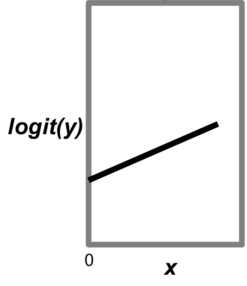

```{r knitr_setup, include=FALSE, cache=FALSE}

library("knitr")

### Chunk options ###

## Text results
opts_chunk$set(echo = FALSE, warning = FALSE, message = FALSE, size = 'tiny')

## Code decoration
opts_chunk$set(tidy = FALSE, comment = NA, highlight = TRUE, prompt = FALSE, crop = TRUE)

# ## Cache
# opts_chunk$set(cache = TRUE, cache.path = "knitr_output/cache/")

# ## Plots
# opts_chunk$set(fig.path = "knitr_output/figures/")
opts_chunk$set(fig.align = 'center', out.width = '90%')

### Hooks ###
## Crop plot margins
knit_hooks$set(crop = hook_pdfcrop)

## Reduce font size
## use tinycode = TRUE as chunk option to reduce code font size
# see http://stackoverflow.com/a/39961605
knit_hooks$set(tinycode = function(before, options, envir) {
  if (before) return(paste0("\n \\", options$size, "\n\n"))
  else return("\n\n \\normalsize \n")
  })

```


## How I was taught statistics

```{r out.width="100%"}
include_graphics("images/tests_diagram.png")
```


## So many questions

- **Why** should we really use analysis Y over Z?

- What if my data are **not Normal**?

- What if they are **not independent**?

- Why am I getting **different p-values** with different tests?

- What even is a **p-value**?

- How can I take **different factors** into account?

- Can I make **predictions**?


## A unified framework

```{r out.width="100%"}
include_graphics("images/flowchart.png")
```


---

## Linear regression

\Large $$y = a + bx$$

```{r out.width="60%"}
include_graphics("images/framework_xquant.png")
```


## Is predictor X qualitative?

\Large $$y = a + bx_2$$

```{r out.width="30%"}

```


## More than 2 groups?

\Large $$y = a + bx_2 + cx_3$$

```{r out.width="30%"}

```


## My data (residuals) are not Normal

\Large $$y = f(a + bx)$$

```{r out.width="30%"}

```


## My data are structured (space, time, phylogeny)

\Large $$y = f(a + bx + \eta)$$


## Relationships are not linear

\Large $$y = a + f(x)$$

```{r out.width="30%"}

```


---

\Large

t-tests

ANOVA

regression

...

are special cases of GLM

---

\Large

With GLM we can analyse 

many different types of data
  
using many predictors 

(quantitative & qualitative)
  

---

\large

**Unified, coherent framework** for data analysis with many extensions:

- **GLMM** (mixed models): accomodate data structure & variation (space, time, phylogeny)

- **GAMM** (generalised additive models): non-linear relationships

- **Model-based multivariate** statistics

- **Bayesian** modelling


---

The Generalised Linear Model (GLM) is a particularly reasonable vantage point on statistical analyses, as **many tests and procedures are special cases** of the GLM. The downside of that (and any other) vantage point is that **we first have to climb it**. There are the morass of unfamiliar terminology, the scree slopes of probability and the cliffs of distributions. **The vista, however, is magnificent**. From the GLM, t-test, ANOVA and regression neatly arrange themselves into regular patterns, and we can see the paths
leading towards the horizon: to time series analyses, Bayesian statistics, spatial statistics and
so forth.

\footnotesize 
[Dormann 2020](https://www.springer.com/gp/book/9783030550196)

