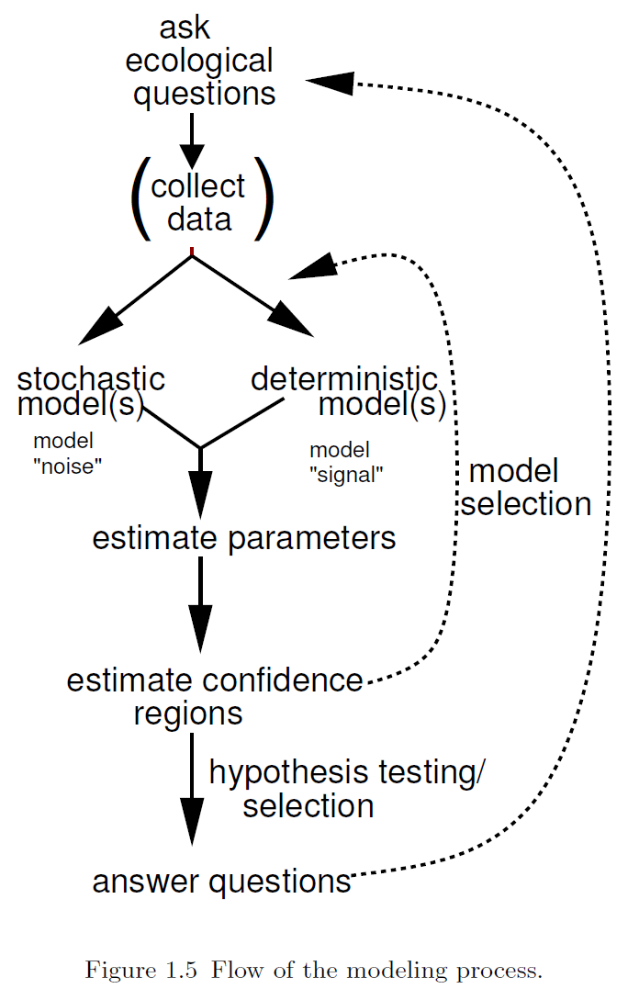

```{r include=FALSE, cache=FALSE}

library(rmarkdown)
library(knitr)

### Chunk options ###

## Text results
opts_chunk$set(echo = TRUE, warning = FALSE, message = FALSE)

## Code decoration
opts_chunk$set(tidy = FALSE, comment = NA, highlight = TRUE, size = "footnotesize")

# ## Cache
opts_chunk$set(cache = 2, cache.path = "knitr_output/cache/")
# opts_chunk$set(cache.extra = rand_seed)
# 
# ## Plots
opts_chunk$set(fig.path = "knitr_output/figures/")
# opts_chunk$set(dpi = 300, fig.align = "default")   # may want 'center' sometimes
# 
# # Figure format
# opts_chunk$set(dev='pdf')  # e.g. choose among 'pdf', 'png', 'svg'...
# # may include specific dev.args as a list... see knitr help


### Hooks ###

## Crop plot margins
#knit_hooks$set(crop = hook_pdfcrop)   


```


## Q: Survival of passengers on the Titanic ~ Class

Read `titanic_long.csv` dataset.

```{r prepare_titanic_data, echo=FALSE, eval=FALSE}
titanic <- read.table("http://www.amstat.org/publications/jse/datasets/titanic.dat.txt")
names(titanic) <- c("class", "age", "sex", "survived")
titanic$class <- factor(titanic$class, labels = c("crew", "first", "second", "third"))
titanic$age <- factor(titanic$age, labels = c("child", "adult"))
titanic$sex <- factor(titanic$sex, labels = c("female", "male"))
write.csv(titanic, file = "data-raw/titanic_long.csv", row.names=FALSE, quote=FALSE)
```

```{r read_titanic, echo=FALSE}
titanic <- read.csv("data-raw/titanic_long.csv")
head(titanic)
```


## Let's fit linear model:

```{r titanic_lm, echo=1}
m5 <- lm(survived ~ class, data = titanic)
layout(matrix(1:4, nrow=2))
plot(m5)
par(def.par)
```


## Weird residuals!

```{r titanic_lm_resid, echo=FALSE}
hist(resid(m5))
```


## What if your residuals are clearly non-normal?   |   And variance not constant (heteroscedasticity)?

* Binary variables (0/1)
* Counts (0, 1, 2, 3, ...)


## Generalised Linear Models

1. **Response variable** - distribution `family`
    + Bernouilli - Binomial
    + Poisson
    + Gamma
    + etc
  
2. **Predictors** (continuous or categorical)

3. **Link function**
    + Gaussian: identity
    + Binomial: logit, probit
    + Poisson: log...
    + See [`family`](http://www.rdocumentation.org/packages/stats/functions/family).


## The modelling process



Bolker 2008


## Bernouilli - Binomial distribution (Logistic regression) 

- Response variable: Yes/No (e.g. survival, sex, presence/absence)
- Link function: `logit` (others possible, see `family`).

$$
  \begin{aligned} 
  logit(p) = \ln \left( \dfrac {p} {1-p}\right) \\ 
  \end{aligned} 
$$

Then

$$
  \begin{aligned} 
  Pr(alive) = a + bx \\  
  logit(Pr(alive)) = a + bx \\  
  Pr(alive) = invlogit(a + bx) = \dfrac {e^{a+bx}} {1+e^{a+bx}} \\  
  \end{aligned} 
$$
  


## Back to survival of Titanic passengers 

How many passengers travelled in each class?


## Back to survival of Titanic passengers 

How many passengers travelled in each class?
```{r}
tapply(titanic$survived, titanic$class, length)
```


## Back to survival of Titanic passengers 

How many passengers travelled in each class?
```{r}
tapply(titanic$survived, titanic$class, length)
```

How many survived?


## Back to survival of Titanic passengers 

How many passengers travelled in each class?
```{r}
tapply(titanic$survived, titanic$class, length)
```

How many survived?
```{r}
tapply(titanic$survived, titanic$class, sum)
```


## Back to survival of Titanic passengers 

How many passengers travelled in each class?
```{r}
tapply(titanic$survived, titanic$class, length)
```

How many survived?
```{r}
tapply(titanic$survived, titanic$class, sum)
```

What proportion survived in each class?
```{r}
as.numeric(tapply(titanic$survived, titanic$class, mean))
```


## Back to survival of Titanic passengers (dplyr)

Passenger survival according to class
```{r titanic_dplyr}
library(dplyr)
titanic %>%
  group_by(class, survived) %>%
  summarise(count = n())
```

Or `summarise(group_by(titanic, class, survived), count = n())`


## Or graphically...

```{r titanic_eda}
plot(factor(survived) ~ class, data = titanic)
```


## Fitting GLMs in R: `glm`

```{r titanic_glm, echo=1}
tit.glm <- glm(survived ~ class, data=titanic, family=binomial)
summary(tit.glm)
```

These estimates are in logit scale!


## Interpreting logistic regression output 

Parameter estimates (logit-scale)
```{r tit_glm_coef, echo=FALSE}
coef(tit.glm)
```

**We need to back-transform**: apply *inverse logit*    
Crew probability of survival:
```{r tit_glm_invlogit}
plogis(coef(tit.glm)[1])
```

Looking at the data, the proportion of crew who survived is
```{r crew_surv, echo=FALSE}
sum(titanic$survived[titanic$class == "crew"]) / nrow(titanic[titanic$class == "crew", ])
```


## Q: Probability of survival for 1st class passengers? 

```{r first_surv}
plogis(coef(tit.glm)[1] + coef(tit.glm)[2])
```

Needs to add intercept (baseline) to the parameter estimate. Again this value matches the data: 
```{r first_surv_data}
sum(titanic$survived[titanic$class == "first"]) /   
  nrow(titanic[titanic$class == "first", ])
```


## Model interpretation using `effects` package

```{r tit_glm_effects}
library(effects)
allEffects(tit.glm)
```

## Effects plot

```{r effects_plot}
plot(allEffects(tit.glm))
```


## Logistic regression: model checking

```{r tit_glm_check, echo=FALSE}
layout(matrix(1:4, nrow=2))
plot(tit.glm)
par(def.par)
```

Not very useful.


## Binned residual plots for logistic regression

```{r binnedplot}
predvals <- predict(tit.glm, type="response")
arm::binnedplot(predvals, titanic$survived - predvals)
```


## Residual diagnostics with DHARMa

```{r echo=TRUE}
library(DHARMa)
simulateResiduals(tit.glm, plot = TRUE)
```

See https://cran.r-project.org/web/packages/DHARMa/vignettes/DHARMa.html


## Recapitulating

1. Import data: `read.table` or `read.csv`

2. Check data: `summary`

3. Plot data: `plot`

4. Fit model: `glm`. Don't forget to specify `family`!
  
5. Examine models: `summary`
  
6. Use `plogis` to apply back-transformation (*invlogit*) to parameter estimates (`coef`). Alternatively, use `allEffects` from `effects` package.

7. Plot model: `plot(allEffects(model))`. Or use `visreg`.

8. Examine residuals: use `arm::binnedplot` or `DHARMa::simulateResiduals`.


# Q: Did men have higher survival than women?


## Plot first

```{r tit_sex_eda}
plot(factor(survived) ~ sex, data = titanic)
```

## Fit model

```{r tit_sex, echo=1}
tit.sex <- glm(survived ~ sex, data = titanic, family = binomial)
summary(tit.sex)
```


## Effects

\begincols
\begincol
```{r tit_sex_effects, echo=FALSE}
allEffects(tit.sex)
```
\endcol

\begincol
```{r tit_sex_effects2, echo=FALSE, fig.height=5, fig.width=4}
plot(allEffects(tit.sex))
```
\endcol
\endcols


# Q: Did women have higher survival because they travelled more in first class?


## Let's look at the data

`tapply`

```{r tit_women}
tapply(titanic$survived, list(titanic$class, titanic$sex), sum)
```

Mmmm...


## Fit model with both factors (interactions)

```{r tit_sex_class, echo=1}
tit.sex.class <- glm(survived ~ class * sex, data = titanic, family = binomial)
arm::display(tit.sex.class)
```


## Effects


\begincols
\begincol
```{r tit_sex_class_effects, echo=FALSE}
allEffects(tit.sex.class)
```
\endcol

\begincol
```{r tit_sex_class_effects2, echo=FALSE, fig.height=5, fig.width=4}
plot(allEffects(tit.sex.class))
```
\endcol
\endcols


So, women had higher probability of survival than men, even within the same class.


# Logistic regression for proportion data


## Read Titanic data in different format

Read `Titanic_prop.csv` data.

```{r read_tit_short, echo = FALSE}
tit.prop <- read.csv("data-raw/Titanic_prop.csv")
summary(tit.prop)
```

These are the same data, but summarized (see `Freq` variable).


## Use cbind(n.success, n.failures) as response

```{r binom_prop, echo=1}
prop.glm <- glm(cbind(Yes, No) ~ Class, data = tit.prop, family = binomial)
summary(prop.glm)
```

## Effects

```{r prop_glm_effects, echo=FALSE}
allEffects(prop.glm)
```

Compare with former model based on raw data:
```{r comp, echo=FALSE}
allEffects(tit.glm)
```

Same results!


# Logistic regression with continuous predictors


----

Example dataset: [GDP and infant mortality](http://vincentarelbundock.github.io/Rdatasets/doc/car/UN.html)

Read `UN_GDP_infantmortality.csv`.

```{r read_gdp, echo = FALSE}
gdp <- read.csv("http://vincentarelbundock.github.io/Rdatasets/csv/car/UN.csv")
names(gdp) <- c("country", "mortality", "gdp")
summary(gdp)
```


## EDA

```{r gdp_eda}
plot(mortality ~ gdp, data = gdp, main = "Infant mortality (per 1000 births)")
```


## Fit model

```{r gdp_glm, echo=1}
gdp.glm <- glm(cbind(mortality, 1000 - mortality) ~ gdp, 
               data = gdp, family = binomial)
summary(gdp.glm)
```


## Effects

```{r gdp_effects}
allEffects(gdp.glm)
```

## Effects plot

```{r gdp_effectsplot}
plot(allEffects(gdp.glm))
```


## Plot model and data

```{r logistic_plot}
plot(mortality/1000 ~ gdp, data = gdp, main = "Infant mortality rate")
curve(plogis(coef(gdp.glm)[1] + coef(gdp.glm)[2]*x), from = 0, to = 40000, add = TRUE, lwd=3, col="red")
```


## Plot model using visreg:

```{r gdp_visreg}
visreg(gdp.glm, scale = "response")
points(mortality/1000 ~ gdp, data = gdp)
```


## Residuals diagnostics with DHARMa

```{r echo=TRUE}
simulateResiduals(gdp.glm, plot = TRUE)
```


# Overdispersion


## Testing for overdispersion (DHARMa)

```{r echo = TRUE}
simres <- simulateResiduals(gdp.glm, refit = TRUE)
testOverdispersion(simres)
```


## Overdispersion in logistic regression with proportion data

```{r logreg_overdisp, echo=1}
gdp.overdisp <- glm(cbind(mortality, 1000 - mortality) ~ gdp, 
               data = gdp, family = quasibinomial)
summary(gdp.overdisp)
```


## Mean estimates do not change after accounting for overdispersion

```{r logreg_overdisp2, echo=FALSE}
allEffects(gdp.overdisp)
allEffects(gdp.glm)
```


## But standard errors (uncertainty) do!

\begincols
\begincol
```{r overdisp_eff1, echo=FALSE, fig.height=5, fig.width=4}
plot(allEffects(gdp.overdisp))
```
\endcol

\begincol
```{r overdisp_eff2, echo=FALSE, fig.height=5, fig.width=4}
plot(allEffects(gdp.glm))
```
\endcol
\endcols


## Plot model and data

\begincols
\begincol
```{r overdisp_plot1, echo=FALSE, fig.height=5, fig.width=4}
library(arm)
plot(mortality/1000 ~ gdp, data = gdp, main = "Binomial", pch=20)
curve(plogis(coef(gdp.glm)[1] + coef(gdp.glm)[2]*x), from = 0, to = 40000, add = TRUE, lwd=3, col="red")
curve(plogis(coef(gdp.glm)[1] - 2*se.coef(gdp.glm)[1] +
               (coef(gdp.glm)[2] - 2*se.coef(gdp.glm)[2])*x), from = 0, to = 40000, add = TRUE, lwd=3, col="blue", lty=2)
curve(plogis(coef(gdp.glm)[1] + 2*se.coef(gdp.glm)[1] +
               (coef(gdp.glm)[2] + 2*se.coef(gdp.glm)[2])*x), from = 0, to = 40000, add = TRUE, lwd=3, col="blue", lty=2)
```
\endcol

\begincol
```{r overdisp_plot2, echo=FALSE, fig.height=5, fig.width=4}
plot(mortality/1000 ~ gdp, data = gdp, main = "Quasibinomial", pch=20)
curve(plogis(coef(gdp.overdisp)[1] + coef(gdp.overdisp)[2]*x), from = 0, to = 40000, add = TRUE, lwd=3, col="red")
curve(plogis(coef(gdp.overdisp)[1] - 2*se.coef(gdp.overdisp)[1] +
               (coef(gdp.overdisp)[2] - 2*se.coef(gdp.overdisp)[2])*x), from = 0, to = 40000, add = TRUE, lwd=3, col="blue", lty=2)
curve(plogis(coef(gdp.overdisp)[1] + 2*se.coef(gdp.overdisp)[1] +
               (coef(gdp.overdisp)[2] + 2*se.coef(gdp.overdisp)[2])*x), from = 0, to = 40000, add = TRUE, lwd=3, col="blue", lty=2)
```
\endcol
\endcols


## Overdispersion

Whenever you fit logistic regression to **proportion** data, check family `quasibinomial`.


## Think about the shape of relationships

y ~ x + z

Really? Not everything has to be linear! Actually, it often is not.

**Think** about shape of relationship. See chapter 3 in Bolker's book.


\begincols

\begincol

```{r echo=FALSE}
curve(0.7 + 0.3*x, ylab="y", las=1)
```

\endcol

\begincol

```{r echo=FALSE}
curve(0.7*x^0.3, ylab="y", las=1)
```

\endcol

\endcols


