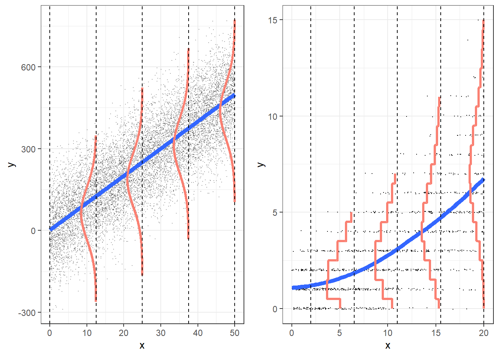

```{r knitr_setup, include=FALSE, cache=FALSE}

library("knitr")

### Chunk options ###

## Text results
opts_chunk$set(echo = FALSE, warning = FALSE, message = FALSE, size = 'tiny')

## Code decoration
opts_chunk$set(tidy = FALSE, comment = NA, highlight = TRUE, prompt = FALSE, crop = TRUE)

# ## Cache
# opts_chunk$set(cache = TRUE, cache.path = "knitr_output/cache/")

# ## Plots
# opts_chunk$set(fig.path = "knitr_output/figures/")
opts_chunk$set(fig.align = 'center', out.width = '90%')

### Hooks ###
## Crop plot margins
knit_hooks$set(crop = hook_pdfcrop)

## Reduce font size
## use tinycode = TRUE as chunk option to reduce code font size
# see http://stackoverflow.com/a/39961605
knit_hooks$set(tinycode = function(before, options, envir) {
  if (before) return(paste0("\n \\", options$size, "\n\n"))
  else return("\n\n \\normalsize \n")
  })

```

```{r}
library("ggplot2")
```


## Types of response variable

\Large

- **Gaussian**: lm

\vspace{3mm}

- **Binary**: glm (family `binomial / quasibinomial`)

\vspace{3mm}

- **Counts**: glm (family `poisson / quasipoisson`)


## Poisson regression

::: nonincremental :::
- Response variable: Counts (0, 1, 2, 3...) - discrete

- Link function: `log`

Then

$$
  \begin{aligned} 
  log(N) = a + bx \\  
  N = e^{a+bx} \\ 
  \end{aligned} 
$$
:::


## Example dataset: Seedling counts in quadrats

```{r seedl_load, echo=1}
seedl <- read.csv("data/seedlings.csv")
summary(seedl)
```


## Exploring the data


:::::::::::::: {.columns align=center}

::: {.column width="30%"}
```{r echo=TRUE}
table(seedl$count)
```
:::

::: {.column width="70%" }
```{r echo=FALSE, out.width="100%"}
hist(seedl$count)
```
:::
::::::::::::::


## Relationship between Nseedlings and light?

```{r poisson_eda2}
plot(seedl$light, seedl$count, xlab = "Light (GSF)", ylab = "Seedlings")
```


## Poisson regression

```{r echo=TRUE}
seedl.glm <- glm(count ~ light, 
                 data = seedl, 
                 family = poisson)
```

which corresponds to

```{r echo=TRUE}
equatiomatic::extract_eq(seedl.glm)
```


## Interpreting Poisson GLM

\scriptsize

```{r poisson_glm}
seedl.glm <- glm(count ~ light, data = seedl, family = poisson)
summary(seedl.glm)
```

\normalsize


## Parameter estimates are in log scale! 

Parameter estimates (log scale):
```{r poisson_params, echo=T}
coef(seedl.glm)[1]
```

\vspace{5mm}

**We need to back-transform**: apply the inverse of the logarithm

```{r echo=T}
exp(coef(seedl.glm)[1])
```


## Using effects package

```{r echo=2}
library(effects)
allEffects(seedl.glm)
```


## Estimated distribution of the **slope** parameter

```{r echo=FALSE, eval=FALSE}
library(arm)
library(ggplot2)

coefs <- as.data.frame(coef(sim(seedl.glm)))
names(coefs) <- c("intercept", "slope")

ggplot(coefs) +
  geom_density(aes(slope), fill = "grey80") +
  xlim(-0.02, 0.02) +
  geom_vline(xintercept = 0) +
  ggtitle("Effect of light on seedling abundance")
```

\scriptsize

```{r echo=T, out.width="70%"}
library("parameters")
plot(simulate_parameters(seedl.glm)) +
  geom_vline(xintercept = 0) +
  ggtitle("Effect of light on seedling abundance")
```


## So what's the relationship between Nseedlings and light?

```{r poisson_effects, echo=2}
#allEffects(seedl.glm)
plot(allEffects(seedl.glm))
```


## Using visreg

```{r poisson_visreg, echo = 2:3}
library(visreg)
visreg(seedl.glm, scale = "response", ylim = c(0, 7))
points(count ~ light, data = seedl, pch = 20)
```

::: hide :::
## Using sjPlot

```{r echo=4}
library(sjPlot)
library(ggplot2)
theme_set(theme_minimal(base_size = 16))
sjPlot::plot_model(seedl.glm, type = "eff", show.data = TRUE)
```
:::


## Low R-squared

```{r echo=T}
library("performance")
r2(seedl.glm)
```


## Describing the model results

```{r echo=T, results='asis'}
library("report")
report(seedl.glm)
```


# Model checking

## Assumptions of Poisson regression

\Large

- Linearity (log response ~ predictors)

- Observations are independent

- Mean = Variance


## Checking Poisson GLM

```{r poisson_check, echo=2}
layout(matrix(1:4, nrow=2))
plot(seedl.glm)
dev.off()
```

::: hide :::
## Poisson regression: model checking

```{r}
ggResidpanel::resid_panel(seedl.glm)
```
:::


## Checking Poisson GLM

```{r echo=2}
library("performance")
check_model(seedl.glm)
```


## Is there pattern of residuals along predictor?

```{r poisson_check2, echo=T}
plot(seedl$light, resid(seedl.glm))
```


::: hide :::
## Calibration plot with count data: rootograms

```{r }
sims <- simulate(seedl.glm, nsim = 100)
yrep <- t(as.matrix(sims))
bayesplot::ppc_rootogram(seedl$count, yrep)
```
:::


## Posterior predictive checking

Simulate data from fitted model (`yrep`) and compare with observed data (`y`)

```{r echo=TRUE, out.width="80%"}
check_predictions(seedl.glm)
```


## Residuals diagnostics with DHARMa

```{r echo=2}
library(DHARMa)
simulateResiduals(seedl.glm, plot = TRUE)
```


# Overdispersion

## Poisson GLM assumes mean = variance

```{r out.width="100%"}

```

\tiny 
[Roback & Legler 2021](https://bookdown.org/roback/bookdown-BeyondMLR/)


## Always check overdispersion with count data

```{r echo=T}
simres <- simulateResiduals(seedl.glm, refit = TRUE)
testDispersion(simres)
```


## Accounting for overdispersion in count data

- Use family `quasipoisson`

- Use negative binomial distribution (`MASS::glm.nb`)

- Include observation-level random effect (e.g. see [Harrison 2014](https://doi.org/10.7717/peerj.616))


## Accounting for overdispersion with family `quasipoisson`

\footnotesize

```{r poisson_overdisp, echo=FALSE}
seedl.overdisp <- glm(count ~ light, data = seedl, family = quasipoisson)
summary(seedl.overdisp)
```


## Mean estimates do not change after accounting for overdispersion

\footnotesize

```{r poisson_overdisp2, echo=TRUE}
allEffects(seedl.overdisp)
allEffects(seedl.glm)
```


## But standard errors may change

:::::::::::::: {.columns align=center}
::: {.column width="50%"}
```{r pois_overdisp_eff1, echo=FALSE}
plot(allEffects(seedl.overdisp))
```
:::

::: {.column width="50%" }
```{r pois_overdisp_eff2, echo=FALSE}
plot(allEffects(seedl.glm))
```
:::
::::::::::::::


## Accounting for overdispersion using negative binomial

\footnotesize

```{r echo=1:2}
library("MASS")
seedl.nb <- glm.nb(count ~ light, data = seedl)
summary(seedl.nb)
```


## Comparing Poisson and Negative Binomial

\scriptsize

```{r echo=TRUE}
compare_models(seedl.glm, seedl.nb)
compare_performance(seedl.glm, seedl.nb)
```


# What if survey plots have different area?

## Shall we *standardise* counts dividing by sampling plot area?

Model would be: count/area ~ light

```{r}
head(seedl)
```


## Avoid regression of ratios 


https://doi.org/10.2307/2983064


## Use `offset` to account for variable sampling effort

```{r echo=TRUE}
seedl.offset <- glm(count ~ light, 
                    offset = log(area), 
                    data = seedl, 
                    family = poisson)
```


## Note estimates now referred to area units!

```{r}
summary(seedl.offset)
```

## Note estimates now referred to area units!

```{r echo=T}
exp(coef(seedl.offset)[1])
```


# Prediction

## Predicting number of seedlings given light

```{r echo =TRUE}
new.lights <- data.frame(light = c(10, 90))
predict(seedl.glm, newdata = new.lights, type = "response", se.fit = TRUE)
```


## Poisson GLM: more examples

- Infant mortality ~ GDP

- Number of cones consumed by squirrels ([data](http://vincentarelbundock.github.io/Rdatasets/doc/COUNT/nuts.html))

- Elephant matings ([Poole 1989](https://doi.org/10.1016/0003-3472(89)90068-7))
