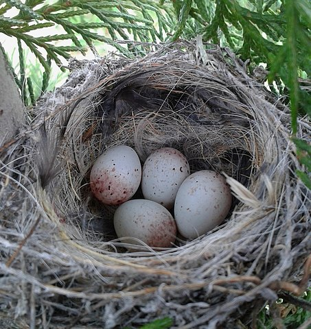
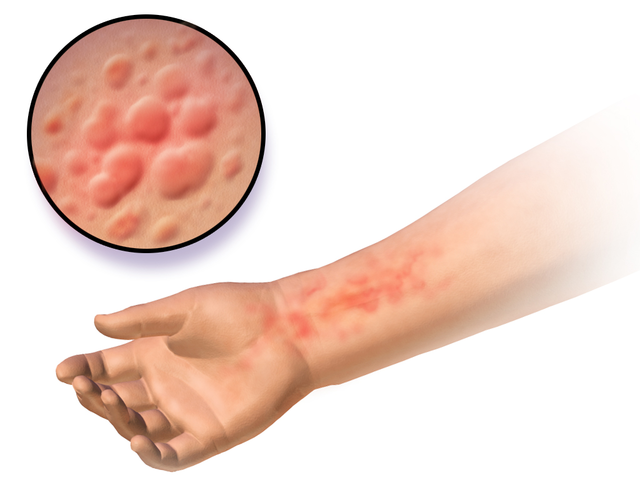

```{r knitr_setup, include=FALSE, cache=FALSE}

library("knitr")

### Chunk options ###

## Text results
opts_chunk$set(echo = FALSE, warning = FALSE, message = FALSE, size = 'tiny')

## Code decoration
opts_chunk$set(tidy = FALSE, comment = NA, highlight = TRUE, prompt = FALSE, crop = TRUE)

# ## Cache
# opts_chunk$set(cache = TRUE, cache.path = "knitr_output/cache/")

# ## Plots
# opts_chunk$set(fig.path = "knitr_output/figures/")
opts_chunk$set(fig.align = 'center', out.width = '90%')

### Hooks ###
## Crop plot margins
knit_hooks$set(crop = hook_pdfcrop)

## Reduce font size
## use tinycode = TRUE as chunk option to reduce code font size
# see http://stackoverflow.com/a/39961605
knit_hooks$set(tinycode = function(before, options, envir) {
  if (before) return(paste0("\n \\", options$size, "\n\n"))
  else return("\n\n \\normalsize \n")
  })

```


## How many eggs in nests?

```{r out.width="15%", fig.align='left'}

```

```{r echo=FALSE, eval=FALSE}
n = 300
diameter <- round(runif(n, 5, 15))
old <- sample(c("no", "yes"), size = n, replace = TRUE, prob = c(0.7, 0.3)) 
eggs <- data.frame(diameter, old)

eggs$n.eggs <- VGAM::rzipois(n, lambda = 0.5*diameter, pstr0 = ifelse(eggs$old == "yes", 0.9, 0.1))
readr::write_csv(eggs, "data/eggs.csv")

```


```{r echo=1}
eggs <- read.csv("data/eggs.csv")
kable(head(eggs, n = 3))
```

`diameter`: nest diameter (cm)

`old`: does nest look old/abandoned?


## How many eggs in nests?

```{r out.width="80%"}
hist(eggs$n.eggs, breaks = length(unique(eggs$n.eggs)))
```

**Many zeros does not mean you need a zero-inflated model!**

Check model afterwards


## How many eggs in nests?

\Large

- Nests may be occupied or not

- Occupied nests may not have eggs (too soon, predation, etc)


## Number of eggs ~ nest diameter * old appearance

```{r echo=TRUE}
coplot(n.eggs ~ diameter | old, data = eggs)
```


## Trying Poisson GLM

```{r echo=1}
eggs.poi <- glm(n.eggs ~ old * diameter, 
              data = eggs, 
              family = poisson)
```


## Trying Poisson GLM

\footnotesize

```{r }
summary(eggs.poi)
```

## Visualising the fitted Poisson GLM

```{r}
library("visreg")
visreg(eggs.poi, xvar = "diameter", by = "old")
```


## Checking Poisson GLM

Simulate data from fitted model (**yrep**) and compare with observed data (**y**)

```{r echo=TRUE, out.width="80%"}
library("performance")
pp_check(eggs.poi)
```


## Checking Poisson GLM with DHARMa

```{r echo=TRUE}
library("DHARMa")
eggs.poi.res <- simulateResiduals(eggs.poi, plot = TRUE)
```


## Checking overdispersion

```{r echo=TRUE}
testDispersion(eggs.poi.res)
```


## Checking zero inflation

```{r echo=TRUE}
testZeroInflation(eggs.poi.res)
```


# Accounting for zero-inflation

## Zero-inflated Poisson/Negative Binomial

Mixture model:

1. Model probability of 0 \hspace{16mm} (`Binomial`)

2. Model counts (including 0) \hspace{1cm} (`Poisson/Negative Binomial`)


## Modelling egg number as Zero-Inflated Poisson (ZIP)

Nests may be occupied or not:

  > Probability nest not occupied ~ old \hspace{12mm} (Binomial)

For occupied nests:

  > Number of eggs ~ Nest diameter \hspace{1cm} (Poisson)

```{r echo = TRUE}
library("glmmTMB")
eggs.zip <- glmmTMB(n.eggs ~ diameter, 
                    family = "poisson", 
                    ziformula = ~ old, 
                    data = eggs)
```

## Modelling egg number as Zero-Inflated Poisson

\scriptsize

```{r}
summary(eggs.zip)
```


## Checking ZIP model

```{r echo=TRUE}
pp_check(eggs.zip)
```


## Checking ZIP model with DHARMa

```{r echo=TRUE}
eggs.zip.res <- simulateResiduals(eggs.zip, plot = TRUE)
```


## Checking ZIP model with DHARMa

```{r echo=TRUE, out.width="100%"}
testZeroInflation(eggs.zip.res)
```


## Checking ZIP model with DHARMa

```{r echo=TRUE}
testDispersion(eggs.zip.res)
```


## Modelling egg number as Zero-Inflated Negative Binomial (ZINB)

(If there were overdispersion with Poisson)

\vspace{5mm}

```{r echo=TRUE}
eggs.zinb <- glmmTMB(n.eggs ~ diameter, 
                     family = "nbinom2", 
                     ziformula = ~ old, 
                     data = eggs)
```


## Modelling egg number as ZINB

\scriptsize

```{r }
summary(eggs.zinb)
```


## Comparing models

\scriptsize

```{r echo=TRUE}
library("parameters")
compare_models(eggs.poi, eggs.zip, eggs.zinb)
```


## Comparing models

\footnotesize

```{r echo=TRUE}
library("performance")
compare_performance(eggs.poi, eggs.zip, eggs.zinb)
```


# Accounting for zero-inflation with hurdle models

## Tracking measles outbreak

Counting number of hives/person

Many people not sick (0 hives)

Those sick, have many hives (>1)


```{r out.width="30%"}

```


## ZIP/ZINB vs Hurdle models

**ZIP/ZINB**: 

  1. Binomial model: probability of zero

  2. Count model (Poisson/NegBin) includes zero
  


**Hurdle**: 

  1. Binomial model: probability of non-zero
  
  2. Count model truncated at 1


## How many hives per skin area?

```{r echo=FALSE, eval=FALSE}
n <- 500
vaccinated <- sample(c(1, 0), size = n, replace = TRUE, prob = c(0.7, 0.3))
age <- round(runif(n, 1, 90))
area.cm2 <- round(runif(n, 5, 10))
hives <- data.frame(age, vaccinated, area.cm2)

exposed <- sample(1:n, n-200)

n.hives <- extraDistr::rtpois(n = length(exposed), 
                                lambda = -2*hives$vaccinated[exposed] + 
                                  0.1*hives$age[exposed] + log(hives$area.cm2[exposed]),
                                a = 1)
summary(n.hives)
hives$n.hives <- 0
hives$n.hives[exposed] <- n.hives

write_csv(hives, "data/hives.csv")
```

\footnotesize

```{r echo=1}
hives <- read.csv("data/hives.csv")
summary(hives)
```


## Many people with 0 hives

```{r}
hist(hives$n.hives, breaks = length(unique(hives$n.hives)))
```

(that does not mean we need zero-inflated model!)


## Number of hives ~ age * vaccinated

```{r echo=TRUE}
coplot(n.hives ~ age | as.factor(vaccinated), data = hives)
```


## Trying Poisson GLM

```{r echo=TRUE}
hives.poi <- glm(n.hives ~ vaccinated * age, 
                 offset = log(area.cm2),
                 data = hives,
                 family = poisson)
```


## Trying Poisson GLM

\footnotesize

```{r }
summary(hives.poi)
```


## Visualising fitted Poisson GLM

```{r echo=FALSE}
hives.poi.vr <- glm(n.hives ~ vaccinated * age +  offset(log(area.cm2)),
                 data = hives,
                 family = poisson)
visreg(hives.poi.vr, xvar = "age", by = "vaccinated")
```


## Checking Poisson GLM

```{r echo=TRUE}
pp_check(hives.poi)
```


## Checking Poisson GLM

```{r echo=TRUE}
hives.poi.res <- simulateResiduals(hives.poi, plot = TRUE)
```


## Checking overdispersion

```{r echo=TRUE}
testDispersion(hives.poi.res)
```


## Checking zero inflation

```{r echo=TRUE}
testZeroInflation(hives.poi.res)
```


## Accounting for zero-inflation with hurdle model

```{r echo=TRUE}
hives.hur <- glmmTMB(n.hives ~ vaccinated + age,
                     family = truncated_poisson, 
                     ziformula = ~ 1,
                     offset = log(area.cm2),
                     data = hives)
```


## Accounting for zero-inflation with hurdle model

\scriptsize

```{r}
summary(hives.hur)
```

## Checking hurdle model

```{r echo=TRUE}
pp_check(hives.hur)
```


## Checking hurdle model with DHARMa

```{r echo=TRUE}
hives.hur.res <- simulateResiduals(hives.hur, plot = TRUE)
```


## Checking zero inflation

```{r echo=TRUE}
testZeroInflation(hives.hur.res)
```


## Checking overdispersion

```{r echo=TRUE}
testDispersion(hives.hur.res)
```


## Comparing models

\footnotesize

```{r echo=TRUE}
compare_models(hives.poi, hives.hur)
```


## Comparing models

\footnotesize

```{r echo=TRUE}
compare_performance(hives.poi, hives.hur)
```


