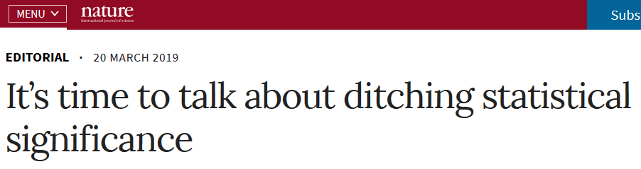

```{r include=FALSE, cache=FALSE}

library(rmarkdown)
library(knitr)

### Chunk options ###

## Text results
opts_chunk$set(echo = TRUE, warning = FALSE, message = FALSE)

## Code decoration
opts_chunk$set(tidy = FALSE, comment = NA, highlight = TRUE, size = "footnotesize")

opts_chunk$set(fig.align = "center") 

opts_chunk$set(cache = TRUE, cache.path = "knitr_cache/")

```


## Example dataset: forest trees

- Download [this dataset](https://raw.githubusercontent.com/Pakillo/LM-GLM-GLMM-intro/trees/data/trees.csv) (or the entire [zip file](https://github.com/Pakillo/LM-GLM-GLMM-intro/raw/trees/datasets.zip))

- Import:

```{r}
trees <- read.csv("data/trees.csv")
head(trees)
```


## Questions

- What is the relationship between DBH and height?

\vspace{10mm}

- Do taller trees have bigger trunks?

\vspace{10mm}

- Can we predict height from DBH? How well?


# Always plot your data first!


## Always plot your data first!


## Exploratory Data Analysis (EDA)

Outliers

```{r indexplot}
plot(trees$height)
```


## Outliers impact on regression


See http://rpsychologist.com/d3/correlation/


## Histogram of response variable

```{r histog}
hist(trees$height)
```


## Histogram of predictor variable

```{r}
hist(trees$dbh)
```

## Scatterplot

```{r scatterplot}
plot(height ~ dbh, data = trees, las = 1)
```

## Scatterplot

```{r echo=3:4}
library(ggplot2)
theme_set(theme_minimal(base_size = 18))
ggplot(trees) +
  geom_point(aes(dbh, height)) 
```


# Model fitting

## Now fit model

Hint: `lm`


## Now fit model

Hint: `lm`

\vspace{5mm}

```{r lm_trees}
m1 <- lm(height ~ dbh, data = trees)
```

\vspace{5mm}

which corresponds to

$$
  \begin{aligned}  
  Height_{i} = a + b \cdot DBH_{i} + \varepsilon _{i} \\  
  \varepsilon _{i}\sim N\left( 0,\sigma^2 \right) \\  
  \end{aligned}  
$$


# Model interpretation


## What does this mean?

```{r summary_lm, echo=FALSE}
summary(m1)
```


## Quiz 

https://pollev.com/franciscorod726


# Communicating results

## Avoid dichotomania of statistical significance

```{r echo=FALSE, out.height='1in', out.width='5in'}

```

- 'Never conclude there is ‘no difference’ or ‘no association’ just because p > 0.05 or CI includes zero'

- Estimate and communicate effect sizes and their uncertainty

- https://doi.org/10.1038/d41586-019-00857-9


## Communicating results

We found a ~~significant~~ positive relationship between DBH and Height ~~(p<0.05)~~ (b = 0.61, SE = 0.01).


## Presenting model results

```{r echo=TRUE}
kable(xtable::xtable(m1), digits = 2)
```


## Presenting model results

```{r echo=TRUE, results='asis'}
texreg::texreg(m1, single.row = TRUE)
```


## Retrieving model coefficients

```{r echo = TRUE}
coef(m1)
```

## Tidy up model coefficients with broom

\footnotesize

```{r}
library(broom)
tidy(m1)
glance(m1)
```

\normalsize


## Confidence intervals

```{r echo = TRUE}
confint(m1)
```

## Using effects package

```{r message=FALSE}
library(effects)
summary(allEffects(m1))
```


# Visualising fitted model


## Plot effects

```{r echo = TRUE}
plot(allEffects(m1))
```


## Plot model (visreg)

```{r visreg}
library(visreg)
visreg(m1)
```


## Plot model (sjPlot - ggplot2)

```{r echo=2, message=FALSE}
library(sjPlot)
sjPlot::plot_model(m1, type = "eff", show.data = TRUE, line.size = 4)
```


# Model checking


## Linear model assumptions

- Linearity (transformations, GAM...)

\vspace{5mm}
  
- Residuals:
    - Independent
    - Equal variance
    - Normal

\vspace{5mm}

- No measurement error in predictors


## Are residuals normal? 

\begincols

\begincol
```{r resid_hist, echo=TRUE, fig.width=5, fig.height=3}
hist(resid(m1))
```
\endcol

\begincol

\scriptsize
```{r coefs_m1, echo=FALSE}
arm::display(m1)
```
\normalsize

\endcol

\endcols
  
    
SD of residuals = `r round(sd(resid(m1)), digits=2)` coincides with estimate of `sigma`.


## Model checking: residuals

```{r echo=FALSE}
def.par <- par(no.readonly = TRUE)
layout(matrix(1:4, nrow=2))
plot(m1)
par(def.par)
```


## Model checking (sjPlot)

```{r}
plot_model(m1, type = "diag")[[1]]
```


## Model checking (ggResidpanel)

```{r}
ggResidpanel::resid_panel(m1, plots = "all")
```


## Interactive model checking (ggResidpanel)

```{r}
ggResidpanel::resid_interact(m1)
```


# Using model for prediction


## How good is the model in predicting tree height?

`fitted` gives predictions for each observation

\vspace{4mm}

```{r}
trees$height.pred <- fitted(m1)
head(trees)
```


## Calibration plot: Observed vs Predicted values

```{r obs_pred, echo=1}
plot(trees$height.pred, trees$height, 
     xlab = "Tree height (predicted)", ylab = "Tree height (observed)", las = 1, xlim = c(10,60), ylim = c(10,60))
abline(a = 0, b = 1)
```


## Using fitted model for prediction

Q: Expected tree height if DBH = 39 cm?

\vspace{3mm}

```{r}
new.dbh <- data.frame(dbh = c(39))
predict(m1, new.dbh, se.fit = TRUE)
```


## Using fitted model for prediction

Q: Expected tree height if DBH = 39 cm?

```{r}
predict(m1, new.dbh, interval = "confidence")
```

```{r}
predict(m1, new.dbh, interval = "prediction")
```


## Workflow

- **Visualise data**

\vspace{5mm}

- **Understand fitted model** (`summary`, `allEffects`...)

\vspace{5mm}

- **Visualise model** (`plot(allEffects)`, `visreg`, `plot_model`...)

\vspace{5mm}

- **Check model** (`plot`, `resid_panel`, calibration plot...)

\vspace{5mm}

- **Predict** (`fitted`, `predict`)


# Categorical predictors (factors)


## Q: Does tree height vary with sex?

```{r boxplot}
plot(height ~ as.factor(sex), data = trees)
```


## Model height ~ sex

```{r echo=1}
m2 <- lm(height ~ sex, data = trees)
summary(m2)
```


## Linear model with categorical predictors

```{r eval=FALSE}
m2 <- lm(height ~ sex, data = trees)
```

corresponds to 

$$
  \begin{aligned} 
  Height_{i} = a + b_{male} + \varepsilon _{i} \\
  \varepsilon _{i}\sim N\left( 0,\sigma^2 \right) \\
  \end{aligned} 
$$


## Model height ~ sex

```{r echo=1}
m2 <- lm(height ~ sex, data = trees)
summary(m2)
```


## Quiz

https://pollev.com/franciscorod726


## Presenting model results

```{r echo=FALSE}
kable(xtable::xtable(m2), digits = 2)
```


## Effects: Height ~ sex

Compare CIs

```{r}
summary(allEffects(m2))
```


## Plot

```{r}
plot(allEffects(m2))
```


## Plot (visreg)

```{r }
visreg(m2)
```


## Plot model (sjPlot)

```{r echo=TRUE}
plot_model(m2, type = "eff")
```


## Model checking: residuals

```{r}
hist(resid(m2))
```


## Model checking: residuals

```{r echo=FALSE}
def.par <- par(no.readonly = TRUE)
layout(matrix(1:4, nrow=2))
plot(m2)
par(def.par)
```


## Model checking (ggResidpanel)

```{r}
ggResidpanel::resid_panel(m2, plots = "all")
```


# Q: Does height differ among field sites?

## Plot data first

```{r}
plot(height ~ site, data = trees)
```


## Linear model with categorical predictors

```{r eval=FALSE}
m3 <- lm(height ~ site, data = trees)
```


$$
  \begin{aligned} 
  y_{i} = a + b_{site2} + c_{site3} + d_{site4} + e_{site5} +...+ \varepsilon _{i} \\   
  \varepsilon _{i}\sim N\left( 0,\sigma^2 \right) \\
  \end{aligned} 
$$


## Model Height ~ site

**All right here?**

```{r echo=1}
m3 <- lm(height ~ site, data = trees)
summary(m3)
```


## site is a factor!

```{r}
trees$site <- as.factor(trees$site)
```


## Model Height ~ site

\scriptsize
```{r echo=FALSE}
m3 <- lm(height ~ site, data = trees)
summary(m3)
```
\normalsize


## Presenting model results

```{r echo=TRUE}
kable(xtable::xtable(m3), digits = 2)
```


## Estimated tree heights for each site

\scriptsize
```{r}
summary(allEffects(m3))
```
\normalsize


## Plot

```{r}
plot(allEffects(m3))
```


## Plot (visreg)

```{r }
visreg(m3)
```


## Plot model (sjPlot)

```{r echo=TRUE}
plot_model(m3, type = "eff")
```


## Model checking: residuals

```{r echo=FALSE}
def.par <- par(no.readonly = TRUE)
layout(matrix(1:4, nrow = 2))
plot(m3)
par(def.par)
```


# Combining continuous and categorical predictors


## Predicting tree height based on dbh and site

```{r eval=FALSE}
lm(height ~ site + dbh, data = trees)
```

corresponds to 

$$
  \begin{aligned} 
  y_{i} = a + b_{site2} + c_{site3} + d_{site4} + e_{site5} +...+ k \cdot DBH_{i} + \varepsilon _{i} \\ 
  \varepsilon _{i}\sim N\left( 0,\sigma^2 \right) \\
  \end{aligned} 
$$


## Predicting tree height based on dbh and site

\scriptsize
```{r echo = FALSE}
m4 <- lm(height ~ site + dbh, data = trees)
summary(m4)
```
\normalsize


## Presenting model results

```{r echo=TRUE}
kable(xtable::xtable(m4), digits = 2)
```


## Estimated tree heights for each site

\scriptsize
```{r}
summary(allEffects(m4))
```
\normalsize


## Plot

```{r}
plot(allEffects(m4))
```


## Plot (visreg)

```{r echo=2}
par(mfcol = c(1, 2))
visreg(m4)
dev.off()
```


## Plot model (sjPlot)

```{r echo=TRUE, out.width='3in'}
plot_model(m4, type = "eff")
```

## Plot model (sjPlot)

```{r echo=TRUE}
plot_model(m4, type = "est")
```


## We have fitted model w/ many intercepts and single slope

```{r echo=FALSE}
plot(height ~ dbh, data = trees, las = 1)
abline(a = coef(m4)[1], b = coef(m4)[11])
for (i in 2:10) {
  abline(a = coef(m4)[1] + coef(m4)[i], b = coef(m4)[11])
}
```


## Model checking: residuals

```{r echo=FALSE}
def.par <- par(no.readonly = TRUE)
layout(matrix(1:4, nrow=2))
plot(m4)
par(def.par)
```


## How good is this model? Calibration plot

```{r}
trees$height.pred <- fitted(m4)
plot(trees$height.pred, trees$height, xlab = "Tree height (predicted)", ylab = "Tree height (observed)", las = 1, xlim = c(10,60), ylim = c(10,60))
abline(a = 0, b = 1)
```


## Model checking with simulated data

```{r out.height="3in", out.width="3.5in"}
library(bayesplot)
sims <- simulate(m4, nsim = 100)
ppc_dens_overlay(trees$height, yrep = t(as.matrix(sims)))
```


# Q: Does allometric relationship between DBH and Height vary among sites?


## Model with interactions

\tiny

```{r echo=FALSE}
m5 <- lm(height ~ site*dbh, data = trees)
summary(m5)
```

\normalsize


## Does slope vary among forests?

```{r}
visreg(m5, xvar = "dbh", by = "site")
```


## Extra exercises

- [paperplanes](https://cran.r-project.org/package=paperplanes): How does flight distance differ with age, gender or paper type?

- [mammal sleep](https://ggplot2.tidyverse.org/reference/msleep.html): Are sleep patterns related to diet?

- iris: Predict petal length ~ petal width and species

- [Penguins data](https://cran.r-project.org/package=palmerpenguins): Body mass ~ Flipper length, Bill length ~ Bill depth, differences across sites...

- [racing pigeons](http://blog.yhat.com/posts/7-funny-datasets.html): is speed related to sex?


