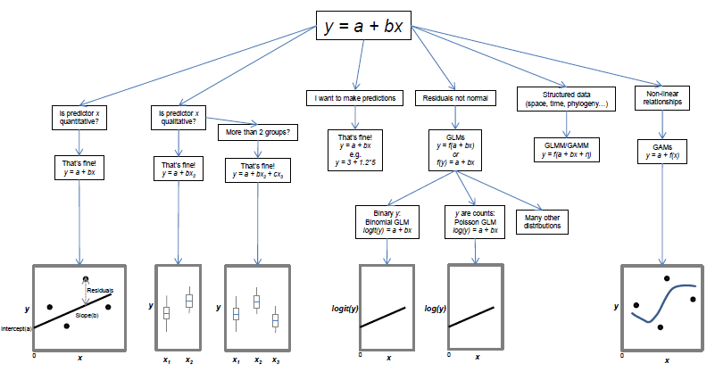

```{r include=FALSE, cache=FALSE}

library(rmarkdown)
library(knitr)

### Chunk options ###

## Text results
opts_chunk$set(echo = TRUE, warning = FALSE, message = FALSE)

## Code decoration
opts_chunk$set(tidy = FALSE, comment = NA, highlight = TRUE, size = "footnotesize")

# ## Cache
#opts_chunk$set(cache = 2, cache.path = "knitr_output/cache/")
# opts_chunk$set(cache.extra = rand_seed)
# 
# ## Plots
#opts_chunk$set(fig.path = "knitr_output/figures/")
# opts_chunk$set(dpi = 300, fig.align = "default")   # may want 'center' sometimes
# 
# # Figure format
# opts_chunk$set(dev='pdf')  # e.g. choose among 'pdf', 'png', 'svg'...
# # may include specific dev.args as a list... see knitr help


### Hooks ###

## Crop plot margins
#knit_hooks$set(crop = hook_pdfcrop)   


```


## Modern statistics are easier than this


## A unified framework

```{r echo=FALSE, out.width='4in'}

```


## Our unified regression framework 


$$
  \begin{aligned}  
  y_{i}=a+bx_{i}+\varepsilon _{i} \\  
  \varepsilon _{i}\sim N\left( 0,\sigma^2 \right) \\  
  \end{aligned}  
$$

\begincols

\begincol
```{r regplot, echo=FALSE, fig.align='left', fig.height=5, fig.width=4}
data(iris)
setosa <- iris[iris$Species == "setosa", ]
plot(setosa[,3], setosa[,4], xlab = "x", ylab = "y", ylim = c(-0.1, 0.65), 
     pch=19, las = 1, cex.lab = 1.5, xlim = c(0, 2))
abline(lm(setosa[,4] ~ setosa[,3]), lwd = 3)
```
\endcol

\begincol

**Data**  
*y* = response variable  
*x* = predictor 
    

**Parameters**  
*a* = intercept    
*b* = slope     
$\sigma$ = residual variation   

$\varepsilon$ = residuals  

\endcol
\endcols


## Residual variation (error) 

\begincols
\begincol
```{r small_residuals, echo=FALSE, fig.width=4}
set.seed(123)
x <- runif(50, 10, 30)
y <- rnorm(50, 4 + 0.3*x, 0.5)
plot(x, y, las = 1, main = "small", ylim = c(4, 18))
abline(lm(y ~ x), lwd = 3)
```
\endcol

\begincol
```{r large_residuals, echo=FALSE, fig.width=4}
y2 <- rnorm(50, 4 + 0.3*x, 3)
plot(x, y2, las = 1, main = "large", ylim = c(4, 18))
abline(lm(y2 ~ x), lwd = 3)
```
\endcol
\endcols


## Residual variation

$$
  \begin{aligned}  
  \varepsilon _{i}\sim N\left( 0,\sigma^2 \right) \\  
  \end{aligned}  
$$

```{r sigmas, echo=FALSE, fig.align='center'}
s1 <- density(rnorm(1000, 0, 2))
s2 <- density(rnorm(1000, 0, 5))
s3 <- density(rnorm(1000, 0, 10))
plot(s3, ylim=c(0,0.2), ylab="", xlab="", main="Distribution of residuals", lwd=2, col="red", yaxt="n")
lines(s2, lwd=2, col="blue")
lines(s1, lwd=2)
Hmisc::labcurve(list(s1, s2, s3), labels=paste("sigma = ", c(2,5,10), sep=""), type="l", col=c("black", "blue", "red"))
```


## In a Normal distribution


## Different ways to write same model

$$
  \begin{aligned}  
  y_{i}=a+bx_{i}+\varepsilon _{i} \\  
  \varepsilon _{i}\sim N\left( 0,\sigma^2 \right) \\  
  \end{aligned}  
$$

.

$$
  \begin{aligned}  
  y_{i} \sim N \left(\mu_{i} , \sigma^2 \right) \\  
  \mu _{i} = a + bx_{i} \\  
  \varepsilon _{i}\sim N\left( 0,\sigma^2 \right) \\  
  \end{aligned}  
$$


