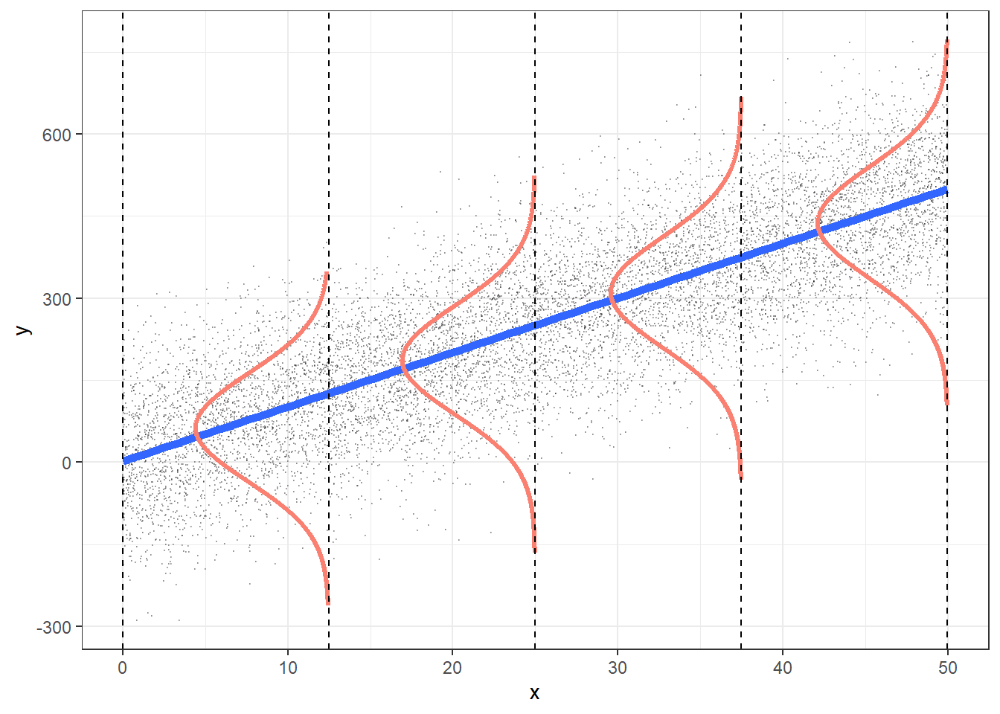

```{r knitr_setup, include=FALSE, cache=FALSE}

library("knitr")

### Chunk options ###

## Text results
opts_chunk$set(echo = FALSE, warning = FALSE, message = FALSE, size = 'tiny')

## Code decoration
opts_chunk$set(tidy = FALSE, comment = NA, highlight = TRUE, prompt = FALSE, crop = TRUE)

# ## Cache
# opts_chunk$set(cache = TRUE, cache.path = "knitr_output/cache/")

# ## Plots
# opts_chunk$set(fig.path = "knitr_output/figures/")
opts_chunk$set(fig.align = 'center', out.width = '90%')

### Hooks ###
## Crop plot margins
knit_hooks$set(crop = hook_pdfcrop)

## Reduce font size
## use tinycode = TRUE as chunk option to reduce code font size
# see http://stackoverflow.com/a/39961605
knit_hooks$set(tinycode = function(before, options, envir) {
  if (before) return(paste0("\n \\", options$size, "\n\n"))
  else return("\n\n \\normalsize \n")
  })

```


## Our unified regression framework (GLM)

$$
  \begin{aligned}  
  y_{i}=a+bx_{i}+\varepsilon _{i} \\  
  \varepsilon _{i}\sim N\left( 0,\sigma^2 \right) \\  
  \end{aligned}  
$$


:::::::::::::: {.columns align=center}
::: {.column width="80%"}
```{r}
library(ggplot2)
data(iris)
setosa <- iris[iris$Species == "setosa", ]

m <- lm(Petal.Width ~ Petal.Length, data = setosa)

gglm <- ggplot(setosa) +
  aes(x = Petal.Length, y = Petal.Width) +
  geom_point(size = 3) +
  theme_minimal(base_size = 20) +
  labs(x = "\nx", y = "y\n") +
  xlim(0, 2.25) +
  ylim(-0.1, NA) +
  geom_abline(intercept = m$coefficients[1], slope = m$coefficients[2], 
              size = 1.5, colour = "blue") +
  geom_segment(aes(x = 0, y = -0.05, xend = 0.2, yend = 0.2), arrow = arrow(),
               colour = "grey60") +
  annotate("text", x = 0.2, y = 0.23, label = "intercept", size = 6) +
  geom_curve(aes(x = 0.5, y = 0.05, xend = 0.5, yend = -0.05), curvature = -0.5,
             colour = "grey60") +
  annotate("text", x = 0.66, y = 0, label = "slope", size = 6) +
  geom_segment(aes(x = 1.9, y = 0.205, xend = 1.9, yend = 0.33), colour = "grey60",
               arrow = arrow(ends = "both")) +
  annotate("text", x = 2.05, y = 0.27, label = "residual", size = 6)

gglm
```

:::
::: {.column width="20%" align=center}

\tiny

**Data**  
*y* = response variable  
*x* = predictor 
    
\vspace{5mm}

**Parameters**  
*a* = intercept    
*b* = slope     
$\sigma$ = residual variation   

\vspace{5mm}
$\varepsilon$ = residuals  
:::
::::::::::::::


## What's the intercept?

**Expected value of `y` when predictors (`x`) = 0**

If x = 0:

  - y = a + b*0
  
  - y = a
  
  
## What's the slope?

**How much `y` increases (or decreases) when `x` increases in 1 unit**

If we have model

$y = 0.5 + \textbf{2*x}$

If `x` increases 1 unit, `y` increases **2 units** 

  - If x = 10 ---> $y = 0.5 + 2*10 = \textbf{20.5}$
  
  - If x = 11 ---> $y = 0.5 + 2*11 = \textbf{22.5}$ 
  


## Slopes can be negative

If we have model

$y = 0.5 \textbf{- 2*x}$

If `x` increases 1 unit, `y` decreases 2 units 

  - If x = 10 -> $y = 0.5 - 2*10 = \textbf{-19.5}$
  
  - If x = 11 -> $y = 0.5 - 2*11 = \textbf{-21.5}$ 
  


---

## What are residuals?

```{r out.width="50%"}
gglm
```


How far points fall from the regression line

Difference between **observed values** and values **predicted** by model (regression line)


## If sigma is large, residuals are larger


\footnotesize

::: nonincremental :::
$$
  \begin{aligned}  
  \varepsilon _{i}\sim N\left( 0,\sigma^2 \right) \\  
  \end{aligned}  
$$

If sigma is larger:

  - points farther from regression line
  
  - larger difference of observed - predicted values
:::


:::::::::::::: {.columns align=center}
::: {.column width="50%"}
```{r small_residuals}
set.seed(123)
x <- runif(50, 10, 30)
y <- rnorm(50, 4 + 0.3*x, 0.5)
plot(x, y, las = 1, main = "small sigma", ylim = c(4, 18), cex.main = 3)
abline(lm(y ~ x), lwd = 3)
```
:::
::: {.column width="50%" align=center}
```{r large_residuals}
y2 <- rnorm(50, 4 + 0.3*x, 3)
plot(x, y2, las = 1, main = "large sigma", ylim = c(4, 18), cex.main = 3)
abline(lm(y2 ~ x), lwd = 3)
```
:::
::::::::::::::


## Residual variation (sigma) is the Std. Dev. of residuals

$$
  \begin{aligned}  
  \varepsilon _{i}\sim N\left( 0,\sigma^2 \right) \\  
  \end{aligned}  
$$

```{r sigmas}
s1 <- density(rnorm(1000, 0, 2))
s2 <- density(rnorm(1000, 0, 5))
s3 <- density(rnorm(1000, 0, 10))
plot(s3, ylim=c(0,0.2), ylab="", xlab="", main="Distribution of residuals", lwd=2, col="red", yaxt="n")
lines(s2, lwd=2, col="blue")
lines(s1, lwd=2)
Hmisc::labcurve(list(s1, s2, s3), labels=paste("sigma = ", c(2,5,10), sep=""), 
                type="l", col=c("black", "blue", "red"))
```


## In a general linear model we assume residuals are

\footnotesize


$$
  \begin{aligned}  
  \varepsilon _{i}\sim N\left( 0,\sigma^2 \right) \\  
  \end{aligned}  
$$

::: nonincremental:::

- Normal

- Centred on 0 (no bias)

- Homogeneous variance (*homoscedasticity*)

:::

```{r out.width="50%"}

```

\raggedright
\tiny [Roback & Legler 2021](https://bookdown.org/roback/bookdown-BeyondMLR/)
\raggedleft


## Different ways to write same model

$$
  \begin{aligned}  
  y_{i}=a+bx_{i}+\varepsilon _{i} \\  
  \varepsilon _{i}\sim N\left( 0,\sigma^2 \right) \\  
  \end{aligned}  
$$


\vspace{15mm}

$$
  \begin{aligned}  
  y_{i} \sim N \left(\mu_{i} , \sigma^2 \right) \\  
  \mu _{i} = a + bx_{i} \\  
  \varepsilon _{i}\sim N\left( 0,\sigma^2 \right) \\  
  \end{aligned}  
$$


## Quiz

https://pollev.com/franciscorod726


