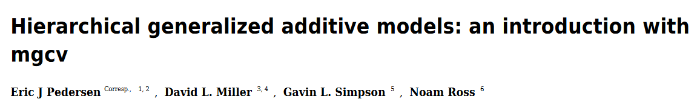

```{r include=FALSE, cache=FALSE}

library(rmarkdown)
library(knitr)

### Chunk options ###

## Text results
opts_chunk$set(echo = TRUE, warning = FALSE, message = FALSE)

## Code decoration
opts_chunk$set(tidy = FALSE, comment = NA, highlight = TRUE, size = "footnotesize")

# ## Cache
opts_chunk$set(cache = TRUE, cache.path = "knitr_cache/")
# opts_chunk$set(cache.extra = rand_seed)
# 
# ## Plots
opts_chunk$set(fig.align = "center") 
#opts_chunk$set(fig.path = "knitr_output/figures/")
# opts_chunk$set(dpi = 300, fig.align = "default")   # may want 'center' sometimes
# 
# # Figure format
# opts_chunk$set(dev='pdf')  # e.g. choose among 'pdf', 'png', 'svg'...
# # may include specific dev.args as a list... see knitr help


### Hooks ###

## Crop plot margins
#knit_hooks$set(crop = hook_pdfcrop)   


```


## Example dataset: trees

- Data on 1000 trees from 10 sites.

- Trees per site: 4 - 392.

```{r echo = 2}
trees <- read.csv("data/trees.csv")
head(trees)
trees$site <- as.factor(trees$site)
```


# Q: What's the relationship between tree diameter and height?


## A simple linear model 

```{r echo = 1}
lm.simple <- lm(height ~ dbh, data = trees)
summary(lm.simple)
```


## Remember our model structure

$$
  \begin{aligned}
  y_{i} \sim N(\mu_{i}, \sigma^2) \\ 
  \mu_{i} = \alpha + \beta x_{i} 
  \end{aligned}
$$

In this case:

$$
  \begin{aligned}
  Height_{i} \sim N(\mu_{i}, \sigma^2)  \\
  \mu_{i} = \alpha + \beta DBH_{i} 
  \end{aligned}
$$

$\alpha$: expected height when DBH = 0

$\beta$: how much height increases with every unit increase of DBH


## There is only one intercept

```{r echo=FALSE}
library(ggplot2)
ggplot(trees) +
  aes(dbh, height) +
  geom_point() +
  geom_smooth(method = "lm", size = 3) +
  labs(x = "DBH (cm)", y = "Height (m)", title = "Single intercept") +
  theme_minimal(base_size = 16)
```


## What if allometry varies among sites?

```{r echo=FALSE}
ggplot(subset(trees, site == 1 | site == 2)) +
  aes(dbh, height, colour = site) +
  geom_point() +
  geom_smooth(method = "lm", size = 3) +
  labs(x = "DBH (cm)", y = "Height (m)", 
       title = "Different intercept for each site") +
  theme_minimal(base_size = 16) +
  theme(legend.position = "none")
```


## Fitting a varying intercepts model with `lm`

\footnotesize

```{r lm_varying, echo=FALSE}
lm.interc <- lm(height ~ factor(site) + dbh, data = trees)
summary(lm.interc)
```

\normalsize


## Single vs varying intercept


\begincols
\begincol

```{r single_interc, echo=FALSE, fig.height=5, fig.width=4}
ggplot(trees) +
  aes(dbh, height) +
  geom_point() +
  geom_smooth(method = "lm", size = 3) +
  labs(x = "DBH (cm)", y = "Height (m)", title = "Single intercept") +
  theme_minimal(base_size = 16)
```

\endcol

\begincol
```{r varying_interc, echo=FALSE, fig.height=5, fig.width=4}
ggplot(trees) +
  aes(dbh, height, colour = site) +
  geom_point(alpha = 0.5) +
  geom_smooth(method = "lm", size = 1.5, se = FALSE) +
  labs(x = "DBH (cm)", y = "Height (m)", 
       title = "Different intercept for each site") +
  theme_minimal(base_size = 16) +
  theme(legend.position = "none")
```
\endcol
\endcols


## Mixed models enable us to account for variability


\begincols

\begincol


www.esourceresearch.org/

\endcol

\begincol

- Varying intercepts

- Varying slopes

\endcol

\endcols


## Mixed model with varying intercepts

$$
  \begin{aligned}  
  y_{i} = a + \alpha_{j} + b \cdot x_{i} + \varepsilon_{i} \\  
  \alpha_{j} \sim N\left( 0,\tau^2 \right) \\  
  \varepsilon _{i}\sim N\left( 0,\sigma^2 \right) \\  
  \end{aligned}  
$$

En nuestro ejemplo:

$$
  \begin{aligned}  
  Height_{i} = a + site_{j} + b \cdot DBH_{i} + \varepsilon_{i} \\  
  site_{j} \sim N\left(0, \tau^2 \right) \\  
  \varepsilon _{i}\sim N\left(0, \sigma^2 \right) \\  
  \end{aligned}  
$$


# Mixed models estimate varying parameters (intercepts and/or slopes) with pooling among levels (rather than considering them fully independent)


## Hence there's gradient between

- **complete pooling**: Single overall intercept.
    - `lm (height ~ dbh)`

- **no pooling**: One *independent* intercept for each site.
    - `lm (height ~ dbh + site)`

- **partial pooling**: Inter-related intercepts.
    - `lmer(height ~ dbh + (1 | site))`


## Random vs Fixed effects?

1. Fixed effects constant across individuals, random effects vary.

2. Effects are fixed if they are interesting in themselves; random if interest in the underlying population.

3. Fixed when sample exhausts the population; random when the sample is small part of the population.

4. Random effect if it's assumed to be a realized value of random variable.

5. Fixed effects estimated using least squares or maximum likelihood; random effects estimated with shrinkage.

http://andrewgelman.com/2005/01/25/why_i_dont_use/


## What is a random effect, really?

- Varies by group

- Variation estimated with **probability model**

Random effects are estimated with *partial pooling*, while fixed effects are not
(infinite variance).


## Shrinkage improves parameter estimation

Especially for groups with low sample size


*From Gelman & Hill p. 253*


## Fitting mixed/multilevel models

\footnotesize
```{r mixed, echo=1:2}
library(lme4)
mixed <- lmer(height ~ dbh + (1|site), data = trees)
summary(mixed)
```
\normalsize

## Retrieve model coefficients

```{r mixed_coefs}
coef(mixed)
```


## Broom: model estimates in tidy form

\footnotesize

```{r}
library(broom.mixed)
tidy(mixed)
```

\normalsize

See also [broom.mixed](https://github.com/bbolker/broom.mixed)


## Visualising model: `allEffects`

\scriptsize

\begincols
\begincol
```{r mixed_vis1, echo=FALSE}
library(effects)
allEffects(mixed)
```
\endcol

\begincol
```{r mixed_vis2, echo=FALSE, fig.height=5, fig.width=4}
plot(allEffects(mixed))
```
\endcol
\endcols

\normalsize


## Visualising model: `visreg`


```{r mixed_vis3, echo=2}
library(visreg)
visreg(mixed, xvar = "dbh", by = "site", re.form = NULL)
```


## Visualising model

```{r echo=TRUE}
visreg(mixed, xvar = "dbh", by = "site", re.form = NULL, overlay = TRUE)
```


## Visualising model: `sjPlot`

```{r echo=FALSE}
library(sjPlot)
theme_set(theme_minimal(base_size = 16))
#sjp.lmer(mixed, type = "ri.slope")
#plot_model(mixed, type = "eff")
```

```{r}
sjPlot::plot_model(mixed, type = "re")
```


## Using merTools to understand fitted model

```{r eval=FALSE}
library(merTools)
shinyMer(mixed)
```


## Checking residuals

```{r mixed_resid}
plot(mixed)
```


## Checking residuals

```{r echo=TRUE}
ggResidpanel::resid_panel(mixed)
```


## Checking residuals (DHARMa)

```{r}
DHARMa::simulateResiduals(mixed, plot = TRUE, use.u = TRUE)
```


## Model checking with simulated data

```{r out.height="3in", out.width="3.5in"}
library(bayesplot)
sims <- simulate(mixed, nsim = 100)  
ppc_dens_overlay(trees$height, yrep = t(as.matrix(sims)))
```


## R-squared for GLMMs

Many approaches! Somewhat polemic (e.g. see [this](https://m-clark.github.io/mixed-models-with-R/issues.html#variance-accounted-for)). 

Nakagawa & Schielzeth propose **marginal** (considering fixed effects only) and **conditional** $R^{2}$ (including random effects too):

```{r}
library(MuMIn)
r.squaredGLMM(mixed)
```


```{r echo=FALSE, eval=FALSE}
## Predicting heights at NEW sites!
#https://github.com/lme4/lme4/issues/388#issuecomment-231398937
newtree <- data.frame(dbh = 30, site = as.factor(25))
p <- bootMer(mixed, 
        function(x) {simulate(x, newdata = newtree, re.form = ~0, allow.new.levels = TRUE)[[1]]},
        nsim = 100)
apply(p$t, 2, mean)
apply(p$t, 2, sd)
# similar to:
apply(simulate(mixed, newdata = newtree, re.form = ~0, allow.new.levels = TRUE, nsim = 100), 1, mean)

```


# Growing the hierarchy: adding site-level predictors


## Model with group-level predictors 

We had:

$$
  \begin{aligned}
  y_{i} = a + \alpha_{j} + b \cdot x_{i} + \varepsilon_{i}  \\
  \alpha_{j} \sim N(0, \tau^2)  \\
  \varepsilon_{i} \sim N(0, \sigma^2) 
  \end{aligned}
$$


Now 

$$
  \begin{aligned}
  y_{i} = a + \alpha_{j} + b \cdot x_{i} + \varepsilon_{i}  \\
  \alpha_{j} \sim N(\mu_{j}, \tau^2)  \\
  \mu_{j} = \delta \cdot Predictor_{j}  \\
  \varepsilon_{i} \sim N(0, \sigma^2)
  \end{aligned}
$$
  

## Are height differences among sites related to temperature?

$$
  \begin{aligned}
  Height_{i} = site_{j} + b \cdot DBH_{i} + \varepsilon_{i}  \\
  site_{j} \sim N(\mu_{j}, \tau^2)  \\
  \mu_{j} = a + \delta \cdot Temperature_{j}  \\
  \varepsilon_{i} \sim N(0, \sigma^2)
  \end{aligned}
$$


## Are height differences among sites related to temperature?

```{r read_sitedata, echo=TRUE, message=FALSE}
sitedata <- read.csv("data/sitedata.csv")
sitedata
```


## Merging trees and site data

```{r echo=TRUE, message=FALSE}
trees.full <- merge(trees, sitedata, by = "site")
head(trees.full)
```


## Fit multilevel model

\scriptsize
```{r echo=1}
group.pred <- lmer(height ~ dbh + (1 | site) + temp, data = trees.full)
summary(group.pred)
```
\normalsize

Too strong correlation of parameters!


## Centre (and scale) continuous variables

```{r}
mean(sitedata$temp)
trees.full$temp.c <- trees.full$temp - 18
```

Temperatures now referred as deviations from 18 ºC (close to average)


## Fit multilevel model

\scriptsize
```{r echo=1}
group.pred <- lmer(height ~ dbh + (1 | site) + temp.c, data = trees.full)
summary(group.pred)
```
\normalsize


## Examine model with merTools

```{r eval=FALSE}
shinyMer(group.pred)
```


## Comparing site effects with and without group predictor

```{r echo=FALSE}
plot(coef(mixed)$site[,1], coef(group.pred)$site[,1],
     xlim = c(10, 25), ylim = c(10, 25), 
     xlab = "Without group predictor", ylab = "With group predictor",
     main = "Estimated site effects", las = 1)
abline(a = 0, b = 1)
```


## Are site effects related to temperature?

```{r echo=FALSE}
plot(sitedata$temp, coef(group.pred)$site[,1],
     xlab = "Temperature", ylab = "site effect")
```


# Varying intercepts and slopes


## Varying intercepts and slopes

There is overall difference in height among sites (different intercepts)
\newline

AND
\newline

Relationship between DBH and Height varies among sites (different slopes)


```{r}
mixed.slopes <- lmer(height ~ dbh + (1 + dbh | site), data=trees)
```


## Varying intercepts and slopes

\footnotesize
```{r echo = FALSE}
summary(mixed.slopes)
```
\normalsize

## Varying intercepts and slopes

```{r echo = FALSE}
coef(mixed.slopes)
```


## Visualising model: `sjPlot`

```{r}
plot_model(mixed.slopes, type = "re")
```


# More examples

## sleepstudy (repeated measures)

```{r echo=FALSE}
data("sleepstudy")
library(ggplot2)
ggplot(sleepstudy) +
  aes(x = Days, y = Reaction) +
  geom_point() +
  facet_wrap(~Subject) 
```


## Varying intercepts and slopes (lme4)

\scriptsize
```{r echo=1}
sleep <- lmer(Reaction ~ Days + (1+Days|Subject), data = sleepstudy)
summary(sleep)
```
\normalsize

## Varying intercepts and slopes (lme4)

```{r eval=FALSE}
visreg(sleep, xvar = "Days", by = "Subject", re.form = NULL)
```


## Fitting multilevel models (GAMM) with `mgcv`

\small
```{r echo = 2}
library(mgcv)
sgamm <- mgcv::gam(Reaction ~ s(Days, Subject, k = 3, bs = "fs"), 
                   data = sleepstudy, method = "REML")
summary(sgamm)
#gam.check(sleep.gamm)
#coef(p)
```
\normalsize


## Fitting multilevel models (GAMM) with `mgcv`

```{r}
visreg(sgamm, xvar = "Days", by = "Subject")
```


## Fitting multilevel models (GAMM) with `mgcv`

```{r out.width='4in', out.height='2.5in', echo=FALSE}

```

https://doi.org/10.7287/peerj.preprints.27320v1


# Multilevel logistic regression


## Q: Relationship between tree size and mortality

```{r}
plot(dead ~ dbh, data = trees)
```


## Q: Relationship between tree size and mortality

```{r}
plot(factor(dead) ~ dbh, data = trees)
```

## Fit simple logistic regression

```{r, echo=1}
simple.logis <- glm(dead ~ dbh, data = trees, family=binomial)
summary(simple.logis)
```


## Logistic regression with *independent* site effects

\footnotesize

```{r, echo=1}
logis2 <- glm(dead ~ dbh + factor(site), data = trees, family=binomial)
summary(logis2)
```

\normalsize


## Fit multilevel logistic regression

\footnotesize
```{r mixed_logis, echo=1}
mixed.logis <- glmer(dead ~ dbh + (1|site), data=trees, family = binomial)
summary(mixed.logis)
```
\normalsize


## Retrieve model coefficients

```{r mixedlogis_coefs}
coef(mixed.logis)
```


## Visualising model: `sjPlot`

```{r}
plot_model(mixed.logis, type = "eff", show.ci = TRUE)
```


# Poisson multilevel regression


## Advantages of multilevel models

- Perfect for **structured data** (space-time)

- Predictors enter at the appropriate level

- Accommodate **variation** in treatment effects

- More **efficient inference** of regression parameters

- Using all the data to perform inferences for groups with small sample size


## Formula syntax for different models

- Varying intercepts
    - `y ~ x + (1 | group)`
    
- Varying intercepts and slopes    
    - `y ~ x + (1 + x | group)` 
    
- Varying intercepts, 2 groups (crossed)
    - `y ~ x + (1 | group1) + (1 | group2)`

- Varying intercepts, 2 groups (nested)
    - `y ~ x + (1 | group/subgroup)` 
    - This is [equivalent](https://m-clark.github.io/mixed-models-with-R/extensions.html#crossed-vs.nested) to `y ~ x + (1 | group1) + (1 | group2)` with distinct labelling of group levels.
    
- Varying intercepts and slopes, 2 groups (crossed)
    - `y ~ x + (1 + x | group1) + (1 + x | group2)`


## GLMM FAQ

https://bbolker.github.io/mixedmodels-misc/glmmFAQ.html


