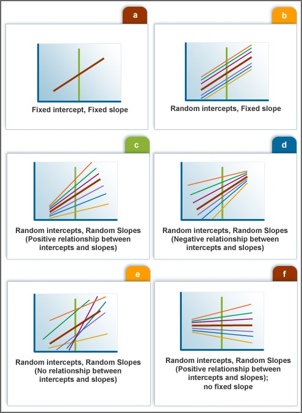
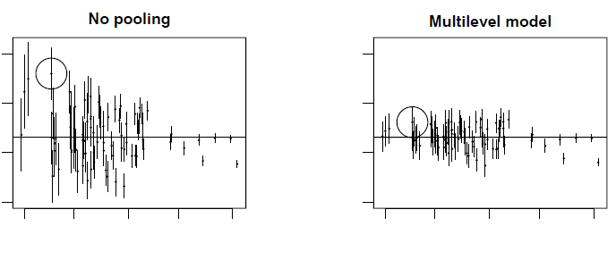

```{r include=FALSE, cache=FALSE}

library(rmarkdown)
library(knitr)

### Chunk options ###

## Text results
opts_chunk$set(echo = TRUE, warning = FALSE, message = FALSE)

## Code decoration
opts_chunk$set(tidy = FALSE, comment = NA, highlight = TRUE, size = "footnotesize")

# ## Cache
opts_chunk$set(cache = 2, cache.path = "knitr_output/cache/")
# opts_chunk$set(cache.extra = rand_seed)
# 
# ## Plots
opts_chunk$set(fig.path = "knitr_output/figures/")
# opts_chunk$set(dpi = 300, fig.align = "default")   # may want 'center' sometimes
# 
# # Figure format
# opts_chunk$set(dev='pdf')  # e.g. choose among 'pdf', 'png', 'svg'...
# # may include specific dev.args as a list... see knitr help


### Hooks ###

## Crop plot margins
#knit_hooks$set(crop = hook_pdfcrop)   


```


## Example dataset: trees

- Data on 1000 trees from 10 plots.

- Trees per plot: 4 - 392.

```{r echo = 2}
trees <- read.table("data-raw/trees.txt", header = TRUE)
head(trees)
```


# Q: What's the relationship between tree diameter and height?


## A simple linear model 

```{r echo = 1}
lm.simple <- lm(height ~ dbh, data = trees)
summary(lm.simple)
```


## Remember our model structure

$$
  \begin{aligned}
  y_{i} \sim N(\mu_{i}, \sigma^2) \\ 
  \mu_{i} = \alpha + \beta x_{i} 
  \end{aligned}
$$

In this case:

$$
  \begin{aligned}
  Height_{i} \sim N(\mu_{i}, \sigma^2)  \\
  \mu_{i} = \alpha + \beta DBH_{i} 
  \end{aligned}
$$

$\alpha$: expected height when DBH = 0

$\beta$: how much height increases with every unit increase of DBH


## There is only one intercept

```{r echo=FALSE}
plot(height ~ dbh, data=trees, las=1, xlab="DBH (cm)", ylab="Height (m)", ylim = c(0, 50), main = "Single intercept")
abline(lm(height ~ dbh, data=trees), lwd=4, col="red")
```


## What if allometry varies among plots?

```{r echo=FALSE}
lm2 <- lm(height ~ factor(plot) + dbh, data = trees)
plot(trees$dbh[trees$plot==1], trees$height[trees$plot==1], 
     pch=20, las=1, xlab="DBH (cm)", ylab="Height (m)", col=1,
     ylim=c(0,50), main = "Different intercept for each plot")
abline(a=coef(lm2)[1], b=coef(lm2)[11], col=1, lwd=2)
for(i in c(2)){ # only 2 plots by now so as not to clutter figure
  points(trees$dbh[trees$plot==i], trees$height[trees$plot==i], pch=20, col=i)
  abline(a=coef(lm2)[1] + coef(lm2)[i], b=coef(lm2)[11], col=i, lwd=2)
}
```


## Fitting a varying intercepts model with `lm`

```{r lm_varying, echo=FALSE}
lm.interc <- lm(height ~ factor(plot) + dbh, data = trees)
arm::display(lm.interc)
```


## Single vs varying intercept


\begincols
\begincol
```{r single_interc, echo=FALSE, fig.height=5, fig.width=4}
trees <- read.table("data-raw/trees.txt", header=TRUE)
plot(height ~ dbh, data=trees, las=1, xlab="DBH (cm)", ylab="Height (m)", ylim = c(0, 50), 
     main = "Pooling all plots")
abline(lm(height ~ dbh, data=trees), lwd=4, col="red")
```
\endcol

\begincol
```{r varying_interc, echo=FALSE, fig.height=5, fig.width=4}
lm2 <- lm(height ~ factor(plot) + dbh, data = trees)
plot(trees$dbh[trees$plot==1], trees$height[trees$plot==1], 
     pch=20, las=1, xlab="DBH (cm)", ylab="Height (m)", col=1,
     ylim=c(0,50), main = "Different intercept for each plot")
abline(a=coef(lm2)[1], b=coef(lm2)[11], col=1, lwd=2)
for(i in 2:10){
  points(trees$dbh[trees$plot==i], trees$height[trees$plot==i], pch=20, col=i)
  abline(a=coef(lm2)[1] + coef(lm2)[i], b=coef(lm2)[11], col=i, lwd=2)
}
```
\endcol
\endcols


## Mixed models enable us to account for variability


\begincols

\begincol

- Varying intercepts

- Varying slopes

\endcol

\begincol



www.esourceresearch.org/

\endcol

\endcols


## Mixed model with varying intercepts

$$
  \begin{aligned}  
  y_{i}=a_{j}+bx_{i}+\varepsilon _{i} \\  
  a_{j} \sim N\left( 0,\tau^2 \right) \\  
  \varepsilon _{i}\sim N\left( 0,\sigma^2 \right) \\  
  \end{aligned}  
$$

En nuestro ejemplo:

$$
  \begin{aligned}  
  Height_{i}=plot_{j}+bDBH_{i}+\varepsilon _{i} \\  
  plot_{j} \sim N\left( 0,\tau^2 \right) \\  
  \varepsilon _{i}\sim N\left( 0,\sigma^2 \right) \\  
  \end{aligned}  
$$


# Mixed models estimate varying parameters (intercepts and/or slopes) with pooling among levels (rather than considering them fully independent)


## Hence there's gradient between

- **complete pooling**: Single overall intercept.
    - `lm (height ~ dbh)`

- **no pooling**: One *independent* intercept for each plot.
    - `lm (height ~ dbh + factor(plot))`

- **partial pooling**: Inter-related intercepts.
    - `lmer(height ~ dbh + (1 | plot))`


## Random vs Fixed effects?

1. Fixed effects constant across individuals, random effects vary.

2. Effects are fixed if they are interesting in themselves; random if interest in the underlying population.

3. Fixed when sample exhausts the population; random when the sample is small part of the population.

4. Random effect if it's assumed to be a realized value of random variable.

5. Fixed effects estimated using least squares or maximum likelihood; random effects estimated with shrinkage.

http://andrewgelman.com/2005/01/25/why_i_dont_use/


## What is a random effect, really?

1. Varies by group

2. Variation estimated with probability model

Random effects are estimated with partial pooling, while fixed effects are not
(infinite variance).


## Shrinkage improves parameter estimation

Especially for groups with low sample size



*From Gelman & Hill p. 253*


## Fitting mixed/multilevel models

```{r mixed, echo=1:2}
library(lme4)
mixed <- lmer(height ~ dbh + (1|plot), data = trees)
arm::display(mixed)
```


## Retrieve model coefficients

```{r mixed_coefs}
coef(mixed)
```


## Broom: model estimates in tidy form

\scriptsize

```{r}
library(broom)
tidy(mixed)
```

\normalsize


## Visualising model: `allEffects`

\scriptsize

\begincols
\begincol
```{r mixed_vis1, echo=FALSE}
library(effects)
allEffects(mixed)
```
\endcol

\begincol
```{r mixed_vis2, echo=FALSE, fig.height=5, fig.width=4}
plot(allEffects(mixed))
```
\endcol
\endcols

\normalsize


## Visualising model: `visreg`


```{r mixed_vis3, echo=FALSE, fig.height=3, fig.width=2.5}
library(visreg)
visreg(mixed)
```

## Visualising model: `sjPlot`

```{r}
library(sjPlot)
sjp.lmer(mixed, type = "ri.slope")
```


## Visualising model: `sjPlot`

```{r}
sjp.lmer(mixed)
```


## Visualising model: `sjPlot`

```{r}
sjp.lmer(mixed, type = "eff", show.ci = TRUE)
```


## Using merTools to understand fitted model

```{r eval=FALSE}
library(merTools)
shinyMer(mixed)
```


## Plotting regression for individual forest plots

```{r mixed_plot}
nplot <- 2
plot(trees$dbh[trees$plot==nplot], trees$height[trees$plot==nplot])
abline(a=coef(mixed)$plot[nplot, 1], b=coef(mixed)$plot[nplot, 2], lwd=2)
```


## Checking residuals

```{r mixed_resid}
plot(mixed)
```


## Checking residuals (DHARMa)

```{r}
simulateResiduals(mixed, plot = TRUE, use.u = TRUE)
```


## Model checking with simulated data

```{r out.height="3in", out.width="3.5in"}
library(bayesplot)
sims <- simulate(mixed, nsim = 100)  
ppc_dens_overlay(trees$height, yrep = t(as.matrix(sims)))
```


## R-squared for GLMMs

Many approaches! Somewhat polemic. 

Nakagawa & Schielzeth propose **marginal** (considering fixed effects only) and **conditional** $R^{2}$ (including random effects too):

```{r}
library(MuMIn)
r.squaredGLMM(mixed)
```


# Growing the hierarchy: adding plot-level predictors


## Model with group-level predictors 

We had:

$$
  \begin{aligned}
  y_{i} = a_{j} + bx_{i} + \varepsilon_{i}  \\
  a_{j} \sim N(0, \tau^2)  \\
  \varepsilon_{i} \sim N(0, \sigma^2) 
  \end{aligned}
$$


Now 

$$
  \begin{aligned}
  y_{i} = a_{j} + bx_{i} + \varepsilon_{i}  \\
  a_{j} \sim N(\mu_{j}, \tau^2)  \\
  \mu_{j} = \gamma + \delta \cdot predictor_{j}  \\
  \varepsilon_{i} \sim N(0, \sigma^2)
  \end{aligned}
$$
  


## Merging trees and plot data

```{r read_plotdata, echo=TRUE, message=FALSE}
plotdata <- read.csv("data-raw/plotdata.csv")
trees.full <- merge(trees, plotdata, by = "plot")
head(trees.full)
```


## Centre continuous variables

Plot temperatures referred as deviations from 15ºC

```{r}
trees.full$temp.c <- trees.full$temp - 15
```


## Fit multilevel model

```{r}
group.pred <- lmer(height ~ dbh + (1 | plot) + temp.c, data = trees.full)
arm::display(group.pred)
```


## Examine model with merTools

```{r eval=FALSE}
shinyMer(group.pred)
```


## Comparing plot effects with and without group predictor

```{r echo=FALSE}
plot(coef(mixed)$plot[,1], coef(group.pred)$plot[,1],
     xlim = c(4, 20), ylim = c(4, 20), 
     xlab = "Without group predictor", ylab = "With group predictor",
     main = "Estimated plot effects")
abline(a=0, b=1)
```


## Are plot effects related to temperature?

```{r}
plot(plotdata$temp, coef(group.pred)$plot[,1],
     xlab = "Temperature", ylab = "Plot effect")
```


# Varying intercepts and slopes


## Varying intercepts and slopes

- There is overall difference in height among plots (different intercepts)

- AND

- Relationship between DBH and Height varies among plots (different slopes)


```{r}
mixed.slopes <- lmer(height ~ dbh + (1 + dbh | plot), data=trees)
```


## Varying intercepts and slopes

```{r echo = FALSE}
arm::display(mixed.slopes)
```


## Varying intercepts and slopes

```{r echo = FALSE}
coef(mixed.slopes)
```


## Visualising model: `sjPlot`

```{r}
sjp.lmer(mixed.slopes)
```

## Visualising model: `sjPlot`

```{r}
sjp.lmer(mixed.slopes, type = "rs.ri")
```


# Multilevel logistic regression


## Q: Relationship between tree size and mortality

```{r}
plot(dead ~ dbh, data = trees)
```


## Q: Relationship between tree size and mortality

```{r}
plot(factor(dead) ~ dbh, data = trees)
```

## Fit simple logistic regression

```{r, echo=1}
simple.logis <- glm(dead ~ dbh, data = trees, family=binomial)
summary(simple.logis)
```


## Logistic regression with *independent* plot effects

```{r, echo=1}
logis2 <- glm(dead ~ dbh + factor(plot), data = trees, family=binomial)
summary(logis2)
```


## Fit multilevel logistic regression

```{r mixed_logis, echo=1}
mixed.logis <- glmer(dead ~ dbh + (1|plot), data=trees, family = binomial)
arm::display(mixed.logis)
```


## Retrieve model coefficients

```{r mixedlogis_coefs}
coef(mixed.logis)
```


## Visualising model: `sjPlot`

```{r}
sjp.glmer(mixed.logis, type = "eff", show.ci = TRUE)
```


## Visualising model: `sjPlot`

```{r}
sjp.glmer(mixed.logis, type = "ri.slope")
```


## Advantages of multilevel models

- Perfect for structured data (space-time)
- Predictors enter at the appropriate level
- Accommodate variation in treatment effects
- More efficient inference of regression parameters
- Using all the data to perform inferences for groups with small sample size


## Formula syntax for different models

y ~ x + (1 | group) # varying intercepts

y ~ x + (1 + x | group) # varying intercepts and slopes

y ~ x + (1 | group/subgroup) # nested

y ~ x + (1 | group1) + (1 | group2) # varying intercepts, crossed

y ~ x + (1 + x | group1) + (1 + x | group2) # varying intercepts and slopes, crossed


