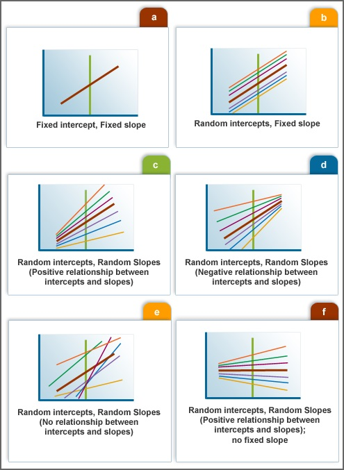
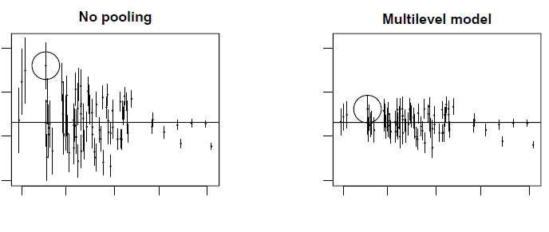
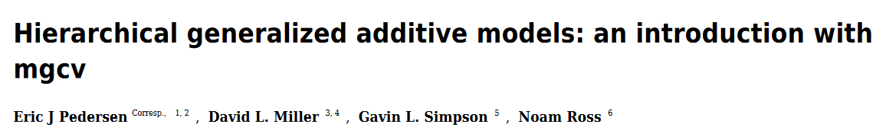

```{r knitr_setup, include=FALSE, cache=FALSE}

library('knitr')

### Chunk options ###

## Text results
opts_chunk$set(echo = TRUE, warning = FALSE, message = FALSE, size = 'tiny')

## Code decoration
opts_chunk$set(tidy = FALSE, comment = NA, highlight = TRUE, prompt = FALSE, crop = TRUE)

# ## Cache
# opts_chunk$set(cache = TRUE, cache.path = 'knitr_output/cache/')

# ## Plots
# opts_chunk$set(fig.path = 'knitr_output/figures/')
opts_chunk$set(fig.align = 'center', out.width = '90%')

### Hooks ###
## Crop plot margins
knit_hooks$set(crop = hook_pdfcrop)

## Reduce font size
## use tinycode = TRUE as chunk option to reduce code font size
# see http://stackoverflow.com/a/39961605
knit_hooks$set(tinycode = function(before, options, envir) {
  if (before) return(paste0('\n \\', options$size, '\n\n'))
  else return('\n\n \\normalsize \n')
  })

```


## Example dataset: trees

- Data on 1000 trees from 10 sites.

- Trees per site: 4 - 392.

```{r echo = 2}
trees <- read.csv('data/trees.csv')
head(trees)
trees$site <- as.factor(trees$site)
```


# Q: What's the relationship between tree diameter and height?


## A simple linear model 

```{r echo = 1}
lm.simple <- lm(height ~ dbh, data = trees)
summary(lm.simple)
```


## Remember our model structure

$$
  \begin{aligned}
  y_{i} \sim N(\mu_{i}, \sigma^2) \\ 
  \mu_{i} = \alpha + \beta x_{i} 
  \end{aligned}
$$

In this case:

$$
  \begin{aligned}
  Height_{i} \sim N(\mu_{i}, \sigma^2)  \\
  \mu_{i} = \alpha + \beta DBH_{i} 
  \end{aligned}
$$

$\alpha$: expected height when DBH = 0

$\beta$: how much height increases with every unit increase of DBH


## There is only one intercept

```{r echo=FALSE}
library(ggplot2)
ggplot(trees) +
  aes(dbh, height) +
  geom_point() +
  geom_smooth(method = 'lm', linewidth = 3) +
  labs(x = 'DBH (cm)', y = 'Height (m)', title = 'Single intercept') +
  theme_minimal(base_size = 16)
```


## What if allometry varies among sites?

```{r echo=FALSE}
ggplot(subset(trees, site == 1 | site == 2)) +
  aes(dbh, height, colour = site) +
  geom_point() +
  geom_smooth(method = 'lm', linewidth = 3) +
  labs(x = 'DBH (cm)', y = 'Height (m)', 
       title = 'Different intercept for each site') +
  theme_minimal(base_size = 16) +
  theme(legend.position = 'none')
```


## Fitting a varying intercepts model with `lm`

\footnotesize

```{r lm_varying, echo=FALSE}
lm.interc <- lm(height ~ site + dbh, data = trees)
summary(lm.interc)
```


## Single vs varying intercept

:::::::::::::: {.columns align=center}

::: {.column width='50%'}

Single intercept

```{r single_interc, echo=FALSE}
library(visreg)
visreg(lm.simple)
```

:::

::: {.column width='50%' }

Different intercept for each site

```{r varying_interc, echo=FALSE}
visreg(lm.interc, xvar = 'dbh', by = 'site', overlay = TRUE, band = FALSE)
```

:::
::::::::::::::


## Mixed models enable us to account for variability



www.esourceresearch.org/


## Mixed model with varying intercepts

$$
  \begin{aligned}  
  y_{i} = a + \alpha_{j} + b \cdot x_{i} + \varepsilon_{i} \\  
  \alpha_{j} \sim N\left( 0,\tau^2 \right) \\  
  \varepsilon _{i}\sim N\left( 0,\sigma^2 \right) \\  
  \end{aligned}  
$$

In our example:

$$
  \begin{aligned}  
  Height_{i} = a + site_{j} + b \cdot DBH_{i} + \varepsilon_{i} \\  
  site_{j} \sim N\left(0, \tau^2 \right) \\  
  \varepsilon _{i}\sim N\left(0, \sigma^2 \right) \\  
  \end{aligned}  
$$

---

\LARGE

Mixed models estimate **varying parameters**

(intercepts and/or slopes)

**with pooling among levels**

(rather than considering them fully independent)


## Hence there's gradient between

- **complete pooling**: Single overall intercept.
    - `lm (height ~ dbh)`
    
\vspace{5mm}

- **no pooling**: One *independent* intercept for each site.
    - `lm (height ~ dbh + site)`
    
\vspace{5mm}

- **partial pooling**: Inter-related intercepts.
    - `lmer(height ~ dbh + (1 | site))`


## Random vs Fixed effects?

1. Fixed effects **constant** across individuals, random effects **vary**.

2. Effects are fixed if they are **interesting** in themselves; random if interest in the underlying population.

3. Fixed when sample **exhausts** the population; random when the sample is small part of the population.

4. Random effect if it's assumed to be a realized value of **random variable**.

5. Fixed effects estimated using least squares or maximum likelihood; random effects estimated with **shrinkage**.

http://andrewgelman.com/2005/01/25/why_i_dont_use/


## What is a random effect, really?

- Varies by group

- Variation estimated with **probability model**

. . .

Random effects are estimated with *partial pooling* (shrinkage, regularisation), while fixed effects are not
(infinite variance).


## Shrinkage improves parameter estimation

Especially for groups with low sample size



*From Gelman & Hill p. 253*


## Fitting mixed/multilevel models

\tiny

```{r mixed, echo=1:2}
library('glmmTMB')
mixed <- glmmTMB(height ~ dbh + (1|site), data = trees)
summary(mixed)
```


## Fitting mixed/multilevel models

\tiny

```{r mixed_lmer, echo=1:2}
library('lme4')
mixed <- lmer(height ~ dbh + (1|site), data = trees)
summary(mixed)
```


## Statistical model structure

```{r}
library(equatiomatic)
equatiomatic::extract_eq(mixed)
```


## Retrieve model coefficients

```{r mixed_coefs}
coef(mixed)
```


## Compare site effects between mixed and lm

```{r echo=FALSE}
lm.noint <- lm(height ~ site + dbh - 1, data = trees)
```

```{r echo=FALSE}
data.frame(lm = round(coef(lm.noint)[1:10], digits = 1), 
  mixed = round(coef(mixed)$site[,1], digits = 1))
```


## Broom: model estimates in tidy form

\footnotesize

```{r}
library(broom.mixed)
tidy(mixed)
```

\normalsize

See [broom.mixed](https://github.com/bbolker/broom.mixed)


## Results table

\scriptsize

```{r}
library(modelsummary)
modelsummary(mixed)
```


## Visualising model: `visreg`


```{r mixed_vis3, echo=2}
library(visreg)
visreg(mixed, xvar = 'dbh', by = 'site') 
```


## Visualising model

```{r echo=2}
mixed <- glmmTMB(height ~ dbh + (1|site), data = trees)
visreg(mixed, xvar = 'dbh', by = 'site', overlay = TRUE)
```


## Visualising model

```{r echo=1}
visreg(mixed, xvar = 'dbh', by = 'site', overlay = TRUE, band = FALSE)
mixed <- lmer(height ~ dbh + (1|site), data = trees)
```


## Visualising model: `sjPlot`

```{r echo=FALSE}
library(sjPlot)
theme_set(theme_minimal(base_size = 16))
#sjp.lmer(mixed, type = 'ri.slope')
#plot_model(mixed, type = 'eff')
```

```{r}
sjPlot::plot_model(mixed, type = 're')
```


## Using merTools to understand fitted model

```{r eval=FALSE}
library('merTools')
shinyMer(mixed)
```


## Checking residuals

```{r mixed_resid}
plot(mixed)
```


## Checking residuals

\footnotesize

```{r echo=TRUE}
library('performance')
check_model(mixed)
```


## Checking residuals (DHARMa)

```{r}
DHARMa::simulateResiduals(mixed, plot = TRUE, re.form = NULL)
```


## Model checking with simulated data

```{r echo=TRUE}
check_predictions(mixed)
```


## R-squared for GLMMs

Many approaches! Somewhat polemic (e.g. see [this](https://m-clark.github.io/mixed-models-with-R/issues.html#variance-accounted-for)). 

Nakagawa & Schielzeth propose **marginal** (considering fixed effects only) and **conditional** $R^{2}$ (including random effects too):

```{r}
r2(mixed)
```


```{r echo=FALSE, eval=FALSE}
## Predicting heights at NEW sites!
#https://github.com/lme4/lme4/issues/388#issuecomment-231398937
newtree <- data.frame(dbh = 30, site = as.factor(25))
p <- bootMer(mixed, 
        function(x) {simulate(x, newdata = newtree, re.form = ~0, allow.new.levels = TRUE)[[1]]},
        nsim = 100)
apply(p$t, 2, mean)
apply(p$t, 2, sd)
# similar to:
apply(simulate(mixed, newdata = newtree, re.form = ~0, allow.new.levels = TRUE, nsim = 100), 1, mean)

```


# Growing the hierarchy: adding site-level predictors


## Model with group-level predictors 

We had:

$$
  \begin{aligned}
  y_{i} = a + \alpha_{j} + b \cdot x_{i} + \varepsilon_{i}  \\
  \alpha_{j} \sim N(0, \tau^2)  \\
  \varepsilon_{i} \sim N(0, \sigma^2) 
  \end{aligned}
$$

. . .

Now 

$$
  \begin{aligned}
  y_{i} = a + \alpha_{j} + b \cdot x_{i} + \varepsilon_{i}  \\
  \alpha_{j} \sim N(\mu_{j}, \tau^2)  \\
  \mu_{j} = \delta \cdot Predictor_{j}  \\
  \varepsilon_{i} \sim N(0, \sigma^2)
  \end{aligned}
$$
  

## Are height differences among sites related to temperature?

$$
  \begin{aligned}
  Height_{i} = site_{j} + b \cdot DBH_{i} + \varepsilon_{i}  \\
  site_{j} \sim N(\mu_{j}, \tau^2)  \\
  \mu_{j} = a + \delta \cdot Temperature_{j}  \\
  \varepsilon_{i} \sim N(0, \sigma^2)
  \end{aligned}
$$


## Are height differences among sites related to temperature?

```{r read_sitedata, echo=TRUE, message=FALSE}
sitedata <- read.csv('data/sitedata.csv')
sitedata
```


## Merging trees and site data

```{r echo=TRUE, message=FALSE}
trees.full <- merge(trees, sitedata, by = 'site')
head(trees.full)
```


## Fit multilevel model

\tiny

```{r echo=1}
group.pred <- lmer(height ~ dbh + (1 | site) + temp, data = trees.full)
summary(group.pred)
```


Too strong correlation of parameters!


## Centre (and scale) continuous variables

```{r}
mean(sitedata$temp)
trees.full$temp.c <- trees.full$temp - 18
```

Temperatures now referred as deviations from 18 ºC (close to average)


## Fit multilevel model

\scriptsize
```{r echo=1}
group.pred <- lmer(height ~ dbh + (1 | site) + temp.c, data = trees.full)
summary(group.pred)
```


## Examine model with merTools

```{r eval=FALSE}
shinyMer(group.pred)
```


## Comparing site effects with and without group predictor

```{r echo=FALSE}
plot(coef(mixed)$site[,1], coef(group.pred)$site[,1],
     xlim = c(10, 25), ylim = c(10, 25), 
     xlab = 'Without group predictor', ylab = 'With group predictor',
     main = 'Estimated site effects', las = 1)
abline(a = 0, b = 1)
```


## Are site effects related to temperature?

```{r echo=FALSE}
plot(sitedata$temp, coef(group.pred)$site[,1],
     xlab = 'Temperature', ylab = 'site effect')
```


## Results table

\footnotesize

```{r}
modelsummary(group.pred)
```


## Model checking

```{r}
check_model(group.pred)
```


# Varying intercepts and slopes


## Varying intercepts and slopes

- There is overall **difference in height** among sites (different intercepts)

- **Relationship** between DBH and Height **varies** among sites (different slopes)

```{r echo=FALSE}
df <- data.frame(dbh = seq(10, 50, by = 1), 
                 height = seq(20, 60, by = 1))
ggplot(df) +
  aes(dbh, height) +
  geom_blank() +
  geom_abline(intercept = 25, slope = 0.6, linewidth = 2) +
  geom_abline(intercept = 40, slope = 0.1, colour = 'steelblue', linewidth = 2) +
  geom_abline(intercept = 50, slope = -0.3, colour = 'orangered', linewidth = 2)
  
```


## Varying intercepts and slopes

```{r}
mixed.slopes <- lmer(height ~ dbh + (1 + dbh | site), data=trees)
equatiomatic::extract_eq(mixed.slopes)
```


## Varying intercepts and slopes

\scriptsize
```{r echo = FALSE}
summary(mixed.slopes)
```


## Varying intercepts and slopes

```{r echo = FALSE}
coef(mixed.slopes)
```


## Results table

\scriptsize

```{r}
modelsummary(mixed.slopes)
```


## Visualising model: `visreg`

```{r}
visreg(mixed.slopes, xvar = "dbh", by = "site")
```


## Visualising model: `sjPlot`

```{r}
plot_model(mixed.slopes, type = 're')
```


## Model checking

```{r}
check_model(mixed.slopes)
```


# More examples

## sleepstudy (repeated measures)

```{r echo=FALSE}
data('sleepstudy')
library(ggplot2)
ggplot(sleepstudy) +
  aes(x = Days, y = Reaction) +
  geom_point() +
  facet_wrap(~Subject) 
```


## Varying intercepts and slopes (lme4)

\scriptsize
```{r echo=1}
sleep <- lmer(Reaction ~ Days + (1+Days|Subject), data = sleepstudy)
summary(sleep)
```


## Varying intercepts and slopes (lme4)

```{r eval=TRUE}
visreg(sleep, xvar = 'Days', by = 'Subject')
```


## Fitting multilevel models (GAMM) with `mgcv`

\scriptsize

```{r echo = 2}
library(mgcv)
sgamm <- mgcv::gam(Reaction ~ s(Days, Subject, k = 3, bs = 'fs'), 
                   data = sleepstudy, method = 'REML')
summary(sgamm)
#gam.check(sleep.gamm)
#coef(p)
```


## Fitting multilevel models (GAMM) with `mgcv`

```{r}
visreg(sgamm, xvar = 'Days', by = 'Subject')
```


## Fitting multilevel models (GAMM) with `mgcv`

```{r echo=FALSE}

```

https://doi.org/10.7287/peerj.preprints.27320v1


# Multilevel logistic regression


## Q: Relationship between tree size and mortality

```{r}
plot(dead ~ dbh, data = trees)
```


## Q: Relationship between tree size and mortality

```{r}
plot(factor(dead) ~ dbh, data = trees)
```

## Fit simple logistic regression

\scriptsize

```{r, echo=1}
simple.logis <- glm(dead ~ dbh, data = trees, family=binomial)
summary(simple.logis)
```


## Logistic regression with *independent* site effects

\scriptsize

```{r, echo=1}
logis2 <- glm(dead ~ dbh + site, data = trees, family=binomial)
summary(logis2)
```


## Fit multilevel logistic regression

\tiny

```{r mixed_logis, echo=1}
mixed.logis <- glmer(dead ~ dbh + (1|site), data=trees, family = binomial)
summary(mixed.logis)
```


## Retrieve model coefficients

```{r mixedlogis_coefs}
coef(mixed.logis)
```


## Visualising model: `visreg`

```{r echo = TRUE}
visreg(mixed.logis, xvar = 'dbh', by = 'site', scale = 'response')
```

::: hide :::

## Visualising model: `sjPlot`

```{r out.width='70%'}
# plot_model(mixed.logis, type = 'eff', show.ci = TRUE)
```


# Poisson multilevel regression

:::


## Advantages of multilevel models

- Perfect for **structured data** (space-time)

- Predictors enter at the appropriate level

- Accommodate **variation** in treatment effects

- More **efficient inference** of regression parameters

- Using all the data to perform inferences for groups with **small sample size**

- Allow predictions for **unobserved groups**


## Formula syntax for different models

- Varying intercepts
    - `y ~ x + (1 | group)`
    
- Varying intercepts and slopes    
    - `y ~ x + (1 + x | group)` 
    
- Varying intercepts, 2 groups (crossed)
    - `y ~ x + (1 | group1) + (1 | group2)`

- Varying intercepts, 2 groups (nested)
    - `y ~ x + (1 | group/subgroup)` 
    - This is [equivalent](https://m-clark.github.io/mixed-models-with-R/extensions.html#crossed-vs.nested) to `y ~ x + (1 | group1) + (1 | group2)` with distinct labelling of group levels.
    
- Varying intercepts and slopes, 2 groups (crossed)
    - `y ~ x + (1 + x | group1) + (1 + x | group2)`


# Heterogeneity bias

## Predictor (temperature) correlates with groups (random site effects)

```{r echo=FALSE, out.width = '100%'}
set.seed(123)

nsites <- 20
ntrees <- 30

df <- data.frame(
  site = rep(1:nsites, each = ntrees),
  tree = rep(1:ntrees, times = nsites))

## Temperature around each tree
df <- df |>
  dplyr::group_by(site) |>
  dplyr::mutate(tree.temp = rnorm(n = ntrees, mean = site, 3)
  )

# df |>
#   dplyr::group_by(site) |>
#   dplyr::summarise(mean(tree.temp))

## Simulate tree height
df <- df |>
  dplyr::rowwise() |>
  dplyr::mutate(tree.height = rnorm(n = 1, mean = 10 + 1*site + 0*tree.temp, sd = 2))

df$site <- as.factor(df$site)

readr::write_csv(df, "data/trees_bias.csv")

# summary(df)

library(ggplot2)
ggplot(df) +
  aes(tree.temp, tree.height, colour = site) +
  geom_point() +
  geom_smooth(method = "lm", se = FALSE) +
  theme_minimal() +
  labs(x = "Temperature around tree", y = "Tree height")

```


## Fitting a model with varying intercepts

\footnotesize

```{r echo=FALSE}
library(glmmTMB)
m <- glmmTMB(tree.height ~ tree.temp + (1 |site), data = df)
summary(m)
```

## Fitting a model with varying intercepts

\footnotesize

```{r echo=TRUE}
visreg(m, xvar = "tree.temp", by = "site", overlay = T, band = F, legend = F)
```


## Fitting a model with varying intercepts and slopes

\footnotesize

```{r echo=FALSE}
m <- glmmTMB(tree.height ~ tree.temp + (1 + tree.temp |site), data = df)
summary(m)
```


## Fitting a model with varying intercepts and slopes

\footnotesize

```{r echo=TRUE}
visreg(m, xvar = "tree.temp", by = "site", overlay = T, band = F, legend = F)
```

## Do predictors vary within- and between groups?

```{r echo=TRUE}
performance::check_group_variation(m)
```


## Group-mean centering

```{r echo=TRUE}
df <- datawizard::demean(df, select = "tree.temp", by = "site")
head(df)
```

## Model with site effects and temperature (between & within)

\tiny

```{r echo=1}
m <- glmmTMB(tree.height ~ tree.temp_between + tree.temp_within + (1|site), data = df)
summary(m)
```

## Model with site effects and temperature (between & within)

```{r echo=TRUE}
visreg(m, xvar = "tree.temp_between", by = "site")
```

## Model with site effects and temperature (between & within)

```{r echo=TRUE}
visreg(m, xvar = "tree.temp_within", by = "site")
```


## To read more about GLMM

\footnotesize 

https://bbolker.github.io/mixedmodels-misc/glmmFAQ.html

http://mfviz.com/hierarchical-models/

https://www.jstor.org/stable/23736938

https://m-clark.github.io/mixed-models-with-R/

https://www.middleprofessor.com/files/applied-biostatistics_bookdown/_book/lmm

https://bookdown.org/roback/bookdown-BeyondMLR/

https://www.learn-mlms.com/

https://doi.org/10.7717/peerj.4794

https://doi.org/10.7717/peerj.9522


## Exercises

```{r eval = FALSE, echo=FALSE}

counts <- DHARMa::createData(sampleSize = 1000, 
                       intercept = 0,
                       fixedEffects = 1,
                       numGroups = 20, 
                       family = poisson(), 
                       overdispersion = 0.5)
counts <- counts[,1:4]
names(counts) <- c('ID', 'count', 'environment', 'species')
readr::write_csv(counts, 'data/mixed_count.csv')

mod <- glmmTMB(count ~ environment + (1|species), data = counts, family = poisson)
DHARMa::simulateResiduals(mod, plot = TRUE)
DHARMa::testDispersion(mod)
```


```{r eval = FALSE, echo=FALSE}
binom <- DHARMa::createData(sampleSize = 1000, 
                       intercept = 0,
                       fixedEffects = 1,
                       numGroups = 20, 
                       family = binomial())
binom <- binom[,1:4]
names(binom) <- c('ID', 'presabs', 'environment', 'species')
readr::write_csv(binom, 'data/mixed_binom.csv')

mod <- glmmTMB(presabs ~ environment + (1|species), data = binom, family = binomial)
DHARMa::simulateResiduals(mod, plot = TRUE)
```


- **Starlings**: body mass growth depending on nest type

- **Mixed_binom**: Species presence/absence ~ environment

- **Mixed_count**: Species counts ~ environment


