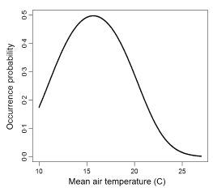
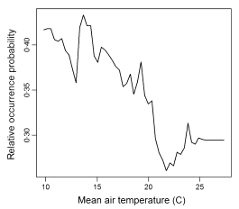

```{r knitr_setup, include=FALSE, cache=FALSE}

library("knitr")

### Chunk options ###

## Text results
opts_chunk$set(echo = FALSE, warning = FALSE, message = FALSE, size = 'tiny')

## Code decoration
opts_chunk$set(tidy = FALSE, comment = NA, highlight = TRUE, prompt = FALSE, crop = TRUE)

# ## Cache
# opts_chunk$set(cache = TRUE, cache.path = "knitr_output/cache/")

# ## Plots
# opts_chunk$set(fig.path = "knitr_output/figures/")
opts_chunk$set(fig.align = 'center', out.width = '90%')

### Hooks ###
## Crop plot margins
knit_hooks$set(crop = hook_pdfcrop)

## Reduce font size
## use tinycode = TRUE as chunk option to reduce code font size
# see http://stackoverflow.com/a/39961605
knit_hooks$set(tinycode = function(before, options, envir) {
  if (before) return(paste0("\n \\", options$size, "\n\n"))
  else return("\n\n \\normalsize \n")
  })

```


## Overfitting and balanced model complexity

- On one hand, we want to **maximise fit**.

- On the other hand, we want to **avoid overfitting** and overly complex models.


## Overfitting and balanced model complexity

```{r simuldata, echo=FALSE}
x <- seq(1:10)
y <- rnorm(10, 2 + 0.2*x, 0.3)
```


```{r linreg, echo=FALSE, fig.height=4, fig.width=4, eval = FALSE}
m1 <- lm(y~x)
plot(x,y, las=1, pch=19, main="Simple linear regression")
abline(m1, lwd=2, col="red")
```


:::::::::::::: {.columns align=center}
::: {.column width="50%"}
```{r overfitted, echo=FALSE, out.width="100%"}
require(gam)
require(visreg)
m2 <- gam(y~s(x, df = 10))
visreg(m2, line.par=list(col="red", lwd=2))
points(x,y, pch=19)
title("Overfit model")
```
:::
::: {.column width="50%" }
```{r wrongmodel, echo=FALSE, out.width="100%"}
y2 <- rnorm(10, 2 + 0.8*x - 0.08*x^2, 0.3)
m3 <- lm(y2~x)
plot(x, y2, las=1, pch=19, main="Underfit/wrong model")
abline(m3, col="red", lwd=2)
```
:::
::::::::::::::


## Overfitting and balanced model complexity


:::::::::::::: {.columns align=center}
::: {.column width="50%"}
GLMM 

```{r}

```
:::

::: {.column width="50%" }
Random forests 

```{r}

```
:::
::::::::::::::

[Wenger & Olden (2012)](http://dx.doi.org/10.1111/j.2041-210X.2011.00170.x)


## Overfitted models will work badly on new data

```{r}

```


## Evaluating models' predictive accuracy

- **Cross-validation** (k-fold, leave one out...)

- **Information Criteria**:
    * AIC
    * BIC
    * DIC
    * WAIC...

- All these methods have flaws!


## AIC (Akaike Information Criteria)

$$
AIC = -2*LogLikelihood + 2K 
$$

* First term: **model fit** 

* **K = number of parameters** (penalisation for model complexity)

* Lower is better

* AIC biased towards complex models.

* AICc recommended with 'small' sample sizes (n/p < 40). But see [Richards 2005](http://www.esajournals.org/doi/pdf/10.1890/05-0074)


## Problems of IC

* No information criteria is panacea: all have problems.

* They estimate *average* out-of-sample prediction error. But errors can differ substantially within dataset.

* Sometimes better models rank poorly (e.g. see [Gelman et al. 2013](https://doi.org/10.1007/s11222-013-9416-2)). Combine with **thorough model checks**.


# So which variables should enter my model?


## Choosing predictors

* Choose variables based on **background knowledge**, rather than throwing plenty of them in a fishing expedition.

* Propose single global model or small set (< 10 - 20) of **reasonable** candidate models.

* Number of variables **balanced with sample size** (e.g. at least 10 - 30 obs per param)

* Assess collinearity between predictors ([Dormann et al 2013](https://doi.org/10.1111/j.1600-0587.2012.07348.x))
    * If |r| > 0.5 - 0.7, consider leaving one variable out, but keep it in mind when interpreting model results.
    * Or combine 2 or more in a synthetic variable (e.g. water deficit ~ Temp + Precip).
    * Many methods available, e.g. sequential, ridge regression... 
    * Measurement error can seriously complicate things (Biggs et al 2009; Freckleton 2011)
    
* For predictors with large effects, **consider interactions**.
    


## Think about the shape of relationships

y ~ x + z

Really? Not everything has to be linear! Actually, it often is not.

**Think** about shape of relationship. 


:::::::::::::: {.columns align=center}

::: {.column width="40%"}
```{r echo=FALSE}
curve(0.7 + 0.3*x, ylab="y", las=1)
```
:::

::: {.column width="60%" }
```{r echo=FALSE}
curve(0.7*x^0.3, ylab="y", las=1)
```
:::
::::::::::::::


# Removing predictors

## Stepwise regression has many problems

* Whittingham et al. (2006) Why do we still use stepwise modelling in ecology and behaviour? J. Animal Ecology.

* Mundry & Nunn (2009) Stepwise Model Fitting and Statistical Inference: Turning Noise into Signal Pollution. Am Nat.

* This includes `stepAIC` (e.g. Dahlgren 2010; Burnham et al 2011; Hegyi & Garamszegi 2011).


## Other common bad practices

- Testing bivariate relationships before building multivariable model

- Removing non-significant predictors

[Heinze & Dunkler 2016](https://doi.org/10.1111/tri.12895)


## Removing predictors?

- Always **keep 'core' predictors** (based on previous knowledge)

- If ratio sample size/number of predictors is low (<10 EPP), avoid variable selection (too unstable)

- If performing variable selection, always **assess stability** (bootstrap, etc)

[Heinze et al 2018](https://doi.org/10.1002/bimj.201700067)


::: hide :::
## Gelman's criteria for removing predictors

(assuming only potentially relevant predictors have been selected a priori)


* NOT significant + expected sign = let it be.

* NOT significant + NOT expected sign = remove it.

* Significant + NOT expected sign = check… confounding variables?

* Significant + expected sign = keep it!

:::


## Summary

1. Choose meaningful variables
    + Beware collinearity
    + Keep good n/p ratio

2. Generate global model or (small) set of candidate models
    + Avoid stepwise and all-subsets
    + Don't assume linear effects: think about appropriate functional relationships
    + Consider interactions for strong main effects
  
3. If > 1 model have similar support, consider model averaging (or blending).

4. Always check fitted models thoroughly 
  
5. Always report effect sizes


