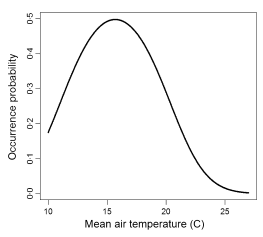
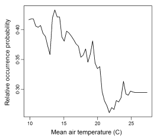

```{r knitr_setup, include=FALSE, cache=FALSE}

library('knitr')

### Chunk options ###

## Text results
opts_chunk$set(echo = FALSE, warning = FALSE, message = FALSE, size = 'tiny')

## Code decoration
opts_chunk$set(tidy = FALSE, comment = NA, highlight = TRUE, prompt = FALSE, crop = TRUE)

# ## Cache
# opts_chunk$set(cache = TRUE, cache.path = 'knitr_output/cache/')

# ## Plots
# opts_chunk$set(fig.path = 'knitr_output/figures/')
opts_chunk$set(fig.align = 'center', out.width = '90%')

### Hooks ###
## Crop plot margins
knit_hooks$set(crop = hook_pdfcrop)

## Reduce font size
## use tinycode = TRUE as chunk option to reduce code font size
# see http://stackoverflow.com/a/39961605
knit_hooks$set(tinycode = function(before, options, envir) {
  if (before) return(paste0('\n \\', options$size, '\n\n'))
  else return('\n\n \\normalsize \n')
  })

```


## Overfitting and balanced model complexity

On one hand, we want to **maximise fit**.

On the other hand, we want to **avoid overfitting** and overly complex models.


```{r simuldata, echo=FALSE}
x <- seq(1:10)
y <- rnorm(10, 2 + 0.2*x, 0.3)
```


```{r linreg, echo=FALSE, fig.height=4, fig.width=4, eval = FALSE}
m1 <- lm(y~x)
plot(x,y, las=1, pch=19, main='Simple linear regression')
abline(m1, lwd=2, col='red')
```


:::::::::::::: {.columns align=center}
::: {.column width='50%'}
```{r overfitted, echo=FALSE, out.width='100%'}
require(gam)
require(visreg)
m2 <- gam(y~s(x, df = 10))
visreg(m2, line.par=list(col='red', lwd=2))
points(x,y, pch=19)
title('Overfit model')
```
:::
::: {.column width='50%' }
```{r wrongmodel, echo=FALSE, out.width='100%'}
y2 <- rnorm(10, 2 + 0.8*x - 0.08*x^2, 0.3)
m3 <- lm(y2~x)
plot(x, y2, las=1, pch=19, main='Underfit/wrong model')
abline(m3, col='red', lwd=2)
```
:::
::::::::::::::


## Overfitting and balanced model complexity


:::::::::::::: {.columns align=center}
::: {.column width='50%'}
GLMM 

```{r}

```
:::

::: {.column width='50%' }
Random forests 

```{r}

```
:::
::::::::::::::

[Wenger & Olden (2012)](http://dx.doi.org/10.1111/j.2041-210X.2011.00170.x)


## Overfitted models will work badly on new data

```{r}

```


## Evaluating models' predictive accuracy

- **Cross-validation** (k-fold, leave one out...)

- **Information Criteria**:
    * AIC
    * BIC
    * DIC
    * WAIC...

- All these methods have flaws!


## AIC (Akaike Information Criteria)

$$
AIC = -2*LogLikelihood + 2K 
$$

* First term: **model fit** 

* **K = number of parameters** (penalisation for model complexity)

* **Lower is better**

* AIC **biased** towards complex models.

* **AICc** recommended with 'small' sample sizes (n/p < 40). But see [Richards 2005](http://www.esajournals.org/doi/pdf/10.1890/05-0074)


## Problems of IC

* No information criteria is panacea: all have problems.

* They estimate **average** out-of-sample prediction error. But errors can differ substantially within dataset.

* Sometimes better models rank poorly (e.g. see [Gelman et al. 2013](https://doi.org/10.1007/s11222-013-9416-2)). Combine with **thorough model checks**.

* Predictive criteria don't help for **causal inference**.


# Predictive criteria don't help for causal inference

```{r}
library(ggplot2)
library(ggdag)
dagg <- dagify(
  seeds ~ plant.size + flower.size + bees,
  flower.size ~ plant.size,
  bees ~ flower.size,
  beetles ~ flower.size + seeds,
  coords = data.frame(name = c('plant.size', 'flower.size', 'seeds', 'bees', 'beetles'),
                      x = c(1, 0, 2, 1, 1),
                      y = c(1, 0, 0, -1, -2)
  ),
  exposure = 'flower.size', 
  outcome = 'seeds'
) 

fulldag <- ggplot(dagg, aes_dag()) +
  geom_dag(use_nodes = FALSE, size = 2, text_col = 'black', text_size = 6) + 
  theme_dag_blank() +
  annotate('text', x = 1, y = 0.2, label = '1', size = 8) +
  annotate('text', x = 1.55, y = 0.6, label = '1', size = 8) +
  annotate('text', x = 1.45, y = -0.4, label = '10', size = 8) +
  annotate('text', x = 1.5, y = -1.3, label = '0.1', size = 8) +
  annotate('text', x = 0.5, y = -1.3, label = '1', size = 8) +
  annotate('text', x = 0.55, y = -0.4, label = '0.5', size = 8) +
  annotate('text', x = 0.45, y = 0.6, label = '0.1', size = 8) 
fulldag
```

```{r include=FALSE}
set.seed(123)
n <- 100
plant.size <- rnorm(n, mean = 100, sd = 20)  # confounder
flower.size <- rnorm(n, 0.1*plant.size, sd = 2)  # exposure

bees <- round(rnorm(n, 0.5*flower.size, sd = 1)) ## mediator
seeds <- round(rnorm(n, 1*flower.size + 10*bees + 1*plant.size, sd = 20))  # outcome

beetles <- round(rnorm(n, 1*flower.size + 0.1*seeds, sd = 2))  ## collider

sunflower <- data.frame(plant.size, flower.size, bees, beetles, seeds)

# models
m.flower <- lm(seeds ~ flower.size, data = sunflower)
m.flower.plant <- lm(seeds ~ flower.size + plant.size, data = sunflower)
m.flower.plant.bees <- lm(seeds ~ flower.size + plant.size + bees, data = sunflower)
m.flower.plant.bees.beetles <- lm(seeds ~ flower.size + plant.size + bees + beetles, data = sunflower)
```

## Predictive criteria don't help to choose correct causal model

Making good predictions doesn't require accurate causal model

```{r}
performance::compare_performance(m.flower, m.flower.plant, m.flower.plant.bees, m.flower.plant.bees.beetles,
                    metrics = c('AIC', 'R2'), verbose = FALSE) |> 
  dplyr::select(-Model, -AIC_wt) |> 
  kable(digits = 1, col.names = c('Model', 'AIC', 'R2'))
```

**'Best model' (based on AIC or R2) not good for causal inference**


# So which variables should enter my model?


## Choosing predictors

* Choose variables based on **background knowledge**, rather than throwing plenty of them in a fishing expedition.

* **Avoid** (forward) **stepwise** methods!

* Propose **single global model** or small set (< 10 - 20) of **reasonable** candidate models.

* Number of variables **balanced with sample size** (e.g. at least 10 - 30 obs per param)
    
* For predictors with large effects, **consider interactions**.
    


## Think about the shape of relationships

y ~ x + z

Really? Not everything has to be linear! Actually, it often is not.

**Think** about shape of relationship. 


:::::::::::::: {.columns align=center}

::: {.column width='40%'}
```{r echo=FALSE}
curve(0.7 + 0.3*x, ylab='y', las=1)
```
:::

::: {.column width='60%' }
```{r echo=FALSE}
curve(0.7*x^0.3, ylab='y', las=1)
```
:::
::::::::::::::


# Removing predictors


## Variance Inflation Factor (VIF) and collinearity

- Model w/ highly correlated predictors -> parameter **uncertainty** will increase (SE)

- VIF > 1 -> multicollinearity

- VIF > 5 or 10 indicate strong collinearity

- Should we remove highly collinear predictors?


## VIF and collinearity

[Collinearity isn't a disease that needs curing](https://doi.org/10.15626/MP.2021.2548)

[The Meaning of Multiple Regression and the Non-Problem of Collinearity](https://doi.org/10.3998/ptpbio.16039257.0010.003)

[The VIF Score. What is it Good For? Absolutely Nothing](https://doi.org/10.1177/10944281231216381)

[Additional caution regarding rules of thumb for VIF](https://doi.org/10.1007/s11135-024-01980-0)


<!-- * Assess collinearity between predictors ([Dormann et al 2013](https://doi.org/10.1111/j.1600-0587.2012.07348.x))
    * If |r| > 0.5 - 0.7, consider leaving one variable out, but keep it in mind when interpreting model results.
    * Or combine 2 or more in a synthetic variable (e.g. water deficit ~ Temp + Precip).
    * Many methods available, e.g. sequential, ridge regression... 
    * Measurement error can seriously complicate things (Biggs et al 2009; Freckleton 2011)  -->


## Removing predictors

- If **predictive** goal, just consider predictive performance

- If **explanatory** goal, consider causal structure of your problem (DAG)

```{r out.width='50%'}
dagg <- dagify(
  response ~ predictor + confounder,
  predictor ~ confounder,
  coords = data.frame(name = c('confounder', 'predictor', 'response'),
                      x = c(1, 0, 2),
                      y = c(1, 0, 0)
  ),
  exposure = 'predictor', 
  outcome = 'response'
) 

ggplot(dagg, aes_dag()) +
  geom_dag(use_nodes = FALSE, size = 2, text_col = 'black', text_size = 6) + 
  theme_dag_blank() 
```


## Stepwise regression has many problems

* Whittingham et al. (2006) **Why do we still use** stepwise modelling in ecology and behaviour? J. Animal Ecology.

* Mundry & Nunn (2009) Stepwise Model Fitting and Statistical Inference: **Turning Noise into Signal Pollution**. Am Nat.

* This includes `stepAIC` (e.g. Dahlgren 2010; Burnham et al 2011; Hegyi & Garamszegi 2011).


## Simpler (best) model provides biased causal estimates

Simulate response depending on two correlated variables \tiny ([Hartig 2022](https://theoreticalecology.github.io/AdvancedRegressionModels/3C-ModelSelection.html#problems-with-model-selection-for-inference))

\normalsize
```{r echo=2:4, out.width='70%'}
set.seed(123)
x1 = runif(100)
x2 = 0.8*x1 + 0.2*runif(100)
y = x1 + x2 + rnorm(100)
df <- data.frame(y, x1, x2)
# kable(head(df), digits = 1)

g1 <- ggplot(df) +
  geom_point(aes(x1, y))

g2 <- ggplot(df) +
  geom_point(aes(x2, y))

library(patchwork)
g1 + g2
```


## Simpler (best) model provides biased causal estimates

Simulate response depending on two correlated variables \tiny ([Hartig 2022](https://theoreticalecology.github.io/AdvancedRegressionModels/3C-ModelSelection.html#problems-with-model-selection-for-inference))

\scriptsize
```{r echo=1}
fullmodel = lm(y ~ x1 + x2)
summary(fullmodel)
```


## Simpler (best) model provides biased causal estimates

\footnotesize

```{r}
library('easystats')
check_collinearity(fullmodel)
```

## Simpler (best) model provides biased causal estimates

\scriptsize

```{r echo=1}
simplemodel = MASS::stepAIC(fullmodel, trace = 0)
summary(simplemodel)
```


## Automated model selection (dredge)

Simulating data with 10 random predictors

\scriptsize
```{r echo=3}
library('MuMIn')
set.seed(8)
dat <- data.frame(y = rnorm(100), 
                  x = matrix(runif(1000), ncol = 10))
kable(head(dat), digits = 1)
```


## Automated model selection

Running `MuMIn::dredge` with 10 random predictors

```{r echo=c(2:3)}
options(na.action = 'na.fail')
full.model <- lm(y ~ ., data = dat)
dd <- MuMIn::dredge(full.model)
```

**Best model:**

```{r}
parameters::parameters(get.models(dd, 1)[[1]], verbose = FALSE, ci = NULL) |> 
  dplyr::select(-t, -df_error) |> 
  kable(digits = 2)
```


## Extract from `dredge` help

*“Let the computer find out” is a poor strategy and usually reflects the fact that the researcher did not bother to think clearly about the problem of interest and its scientific setting*

\scriptsize \hfill Burnham and Anderson 2002


## Variable importance in machine learning

Random forest on **100 random predictors**

\scriptsize

```{r echo=-c(1,2), out.width='80%'}
library(randomForest)
set.seed(2)

dat <- data.frame(x = matrix(runif(50000), ncol = 100), y = runif(500))
rfm <- randomForest::randomForest(y ~ ., data = dat)
varImpPlot(rfm)
```

[Ben Bond-Lamberty](https://gist.github.com/bpbond/8bbb7aa0d0dc845e54b243ae42f1d0f3)


## Other common bad practices

- Testing bivariate relationships before building multivariable model

- Removing non-significant predictors

[Heinze & Dunkler 2016](https://doi.org/10.1111/tri.12895)


## Removing predictors?

- Always **keep 'core' predictors** (based on previous knowledge)

- If ratio sample size/number of predictors is low (<10 EPP), avoid variable selection (too unstable)

- If performing variable selection, always **assess stability** (bootstrap, etc)

[Heinze et al 2018](https://doi.org/10.1002/bimj.201700067)


::: hide :::
## Gelman's criteria for removing predictors

(assuming only potentially relevant predictors have been selected a priori)


* NOT significant + expected sign = let it be.

* NOT significant + NOT expected sign = remove it.

* Significant + NOT expected sign = check… confounding variables?

* Significant + expected sign = keep it!

:::


## Summary

1. Choose meaningful variables
    + Keep good n/p ratio

2. Generate global model or (small) set of candidate models
    + Avoid stepwise and all-subsets
    + Don't assume linear effects: think about appropriate functional relationships
    + Consider interactions for strong main effects
  
3. If > 1 model have similar support, consider model averaging (or blending).

4. Always check fitted models thoroughly 
  
5. Always report effect sizes


